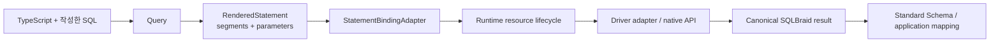
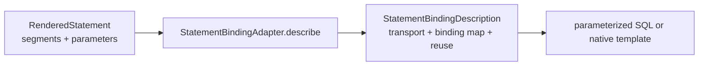
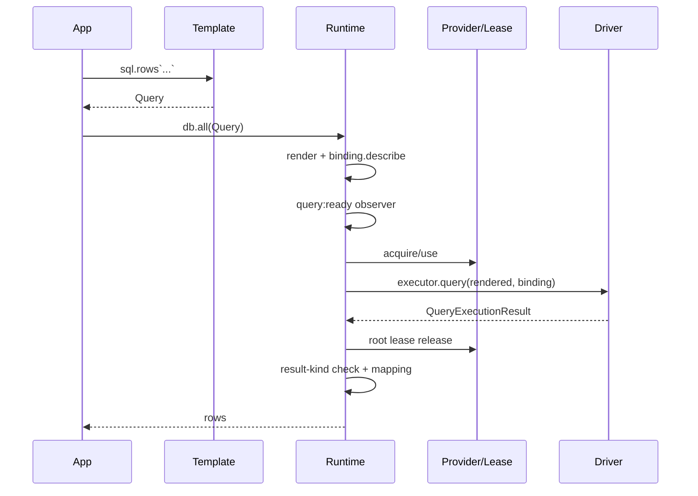
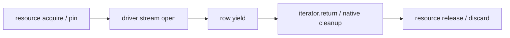

# SQLBraid 기여자용 멘탈 모델

[English](./mental-model.md)

이 문서는 SQLBraid 내부 구조를 빠르게 이해하기 위한 읽기 지도이자 설계 모델입니다. Public API audit, driver-author guide, support record, 테스트를 대체하는 규범 문서가 아니라, 기여자가 코드의 책임 경계를 먼저 이해하도록 돕는 문서입니다.

## 1. 전체 구조 한눈에 보기

SQLBraid는 사용자가 작성한 SQL을 그대로 보이게 유지하면서 데이터 접근 라이브러리에서 흔히 뒤섞이는 책임을 분리합니다.



실행 코어는 다음 4개 층으로 이해하면 가장 쉽습니다.

```mermaid
flowchart TB
  CORE[@sqlbraid/core<br/>계약 + invariant]
  TEMPLATE[@sqlbraid/template<br/>tagged template + rendering]
  RUNTIME[@sqlbraid/runtime<br/>lease + scope + tx + stream + mapping]
  ADAPTERS[driver adapters<br/>pg / mysql2 / MariaDB / Oracle / Tedious / SQLite / Bun.SQL]
  CORE --> TEMPLATE --> RUNTIME --> ADAPTERS

  COMPILER[@sqlbraid/compiler]
  METADATA[@sqlbraid/metadata]
  CODEGEN[@sqlbraid/codegen]
  TOOLING[@sqlbraid/tooling]
  LSP[LSP / CLI / VS Code / Vite]
  COMPILER --> TOOLING --> LSP
  METADATA --> CODEGEN --> TOOLING
  CORE -. contracts .-> COMPILER
  CORE -. TypePolicy .-> CODEGEN
```

`sqlbraid` 패키지는 주로 canonical facade와 re-export surface입니다. 구현을 읽을 때는 facade보다 위 4개 실행 계층에서 시작하는 편이 좋습니다.

## 2. 가장 중요한 invariant: SQL 구조와 값은 끝까지 분리한다

일반 interpolation은 항상 value bind입니다.

```ts
const query = sql.rows<User>`
  SELECT id, name
  FROM users
  WHERE id = ${userId}
`;
```

이 시점의 논리 statement는 아직 `WHERE id = $1`, `WHERE id = ?`, `WHERE id = :1`이 아닙니다. SQL segment와 parameter의 조합으로 표현됩니다.

`RenderedStatement`는 다음 invariant를 유지합니다.

```text
segments.length === parameters.length + 1
```

rendered parameter는 값입니다. identifier, nested query, raw driver fragment, placeholder 문자열이 아닙니다.

SQL 구조가 필요하면 `sql.ident`, `sql.fragment`, `sql.list`, `sql.join`, `sql.empty`, 또는 의도적인 escape hatch인 `sql.raw`를 명시적으로 사용해야 합니다.

이 경계 덕분에 placeholder 문법은 adapter가 소유할 수 있고 동일한 논리 SQL shape을 서로 다른 driver transport로 보낼 수 있습니다.

## 3. `@sqlbraid/core`: 전체 계층이 공유하는 계약

가장 중요한 소스 파일은 [`packages/core/src/index.ts`](../packages/core/src/index.ts)입니다. 일반 구현 파일보다는 authoring, runtime, adapter가 공유하는 protocol 정의라고 생각하는 편이 정확합니다.

주요 영역은 다음과 같습니다.

- query/result 계약: `Query`, `RowQuery`, `CommandQuery`, `CallQuery`, `QueryExecutionResult`;
- 논리 statement 계약: `RenderedStatement`, `RenderedParameter`, `RenderedBulk`;
- binding SPI: `StatementBindingAdapter`, `StatementBindingDescription`, reuse/transport 타입;
- 물리 실행 SPI: `QueryExecutor`, `ConnectionLease`, `ConnectionProvider`;
- application runtime surface: `Database`, prepared query 타입, execution/transaction option;
- 표현 계약: `TypePolicy`, `TypeMapping`;
- observer, capability, routine, public error 계약.

더 작은 [`packages/core/src/driver.ts`](../packages/core/src/driver.ts)는 resource cleanup, 안전한 result property, 생성 savepoint name 검증 같은 driver-author helper를 둡니다.

### Query는 물리 SQL이 아니다

`Query`는 template IR, capture된 값, 선언된 result kind, 선택적 application mapping metadata를 보관합니다. `query.render()`는 `RenderedStatement`를 만들 뿐 driver를 실행하지 않으며 native placeholder 문법도 결정하지 않습니다.

## 4. `@sqlbraid/template`: SQL 작성과 rendering

core 다음에는 [`packages/template/src/index.ts`](../packages/template/src/index.ts)를 읽습니다.

`createSqlTag()`는 dialect-bound `sql` tag를 만들고 frozen `Query` 객체를 생성합니다. 구조 처리가 필요 없는 statement는 template parsing도 필요한 시점까지 늦춥니다.

authoring surface는 값과 SQL 구조를 명확히 구분합니다.

- `${value}` → value bind;
- `sql.ident(name)` → quoted identifier 구조;
- `sql.fragment` → 명시적인 composable SQL 구조;
- `sql.list(values)` → value bind를 포함하는 structural list;
- `sql.join(fragments)` → structural composition;
- `sql.raw(text)` → text를 그대로 SQL 구조로 사용; 신뢰할 수 없는 입력을 넘기면 안 됨;
- `sql.bind(value, hint)` → 값 + 명시적인 DB parameter metadata.

fragment는 dialect에 종속됩니다. 다른 dialect의 fragment를 섞었을 때 SQLBraid는 임의로 re-quote/reinterpret하지 않고 거부합니다.

### Guarded `@braid` directive

`@braid` directive는 `if`, `choose`, `when`, `otherwise`, `where`, `set`, `trim` 같은 local dynamic SQL을 제공합니다. runtime renderer도 IR을 이해하지만 일반 JavaScript template expression은 eager evaluation입니다.

따라서 compiler는 guarded capture를 lower하여 inactive branch 안의 expression 자체가 실행되지 않도록 합니다. `guarded()`와 `capture()`는 compiler가 생성하는 코드의 target이지 별도의 application query language가 아닙니다.

## 5. Binding: `$1`, `?`, `:1`, `@p1`이 처음 등장하는 지점

`StatementBindingAdapter`가 논리 statement와 driver transport 사이의 경계입니다.



binding description은 pure operation이며 connection acquisition 전에 수행됩니다. 잘못된 hint, transport contract, binding identity는 pool lease를 소비하기 전에 실패합니다.

이 분리 덕분에 PostgreSQL, MySQL, Oracle, SQL Server, native template transport가 같은 논리 shape을 서로 다른 방식으로 materialize할 수 있습니다.

## 6. `@sqlbraid/runtime`: 어려운 부분은 SQL이 아니라 lifecycle

runtime의 중심 파일은 [`packages/runtime/src/index.ts`](../packages/runtime/src/index.ts)입니다. 파일이 큰 이유의 대부분은 SQL parsing이 아니라 physical resource ownership 때문입니다.

중심 생성 함수는 `createScopedDatabase()`입니다. `createDatabase()`와 `createPooledDatabase()` 모두 결국 이 함수로 들어갑니다.

일반 materialized query는 다음 함수 순서로 읽으면 됩니다.

```text
prepareObserved()
    ↓
prepare()
    ↓
runPrepared()
    ↓
physical()
    ↓
finalizePhysical()
    ↓
processRows()
```

`db.all(query)` 한 번은 대략 다음 lifecycle을 거칩니다.



### application mapping 전에 lease를 먼저 반환한다

pooled materialized operation에서는 driver I/O와 result materialization이 끝나면 lease를 먼저 반환하고 그 다음 비동기 Standard Schema mapping을 수행합니다. application validation/transformation 때문에 희소한 pool connection을 붙잡아 두지 않는 설계입니다.

stream은 native cursor/result set이 물리 resource를 계속 필요로 하므로 의도적으로 다르게 처리합니다.

## 7. Direct executor, provider, lease

`createDatabase(executor)`는 이미 확보된 하나의 physical execution resource를 감쌉니다. SQLBraid는 접근을 직렬화하지만 underlying client/database의 shutdown을 소유하지 않습니다.

`createPooledDatabase(provider)`는 `ConnectionProvider`를 감쌉니다. provider는 physical lease의 공급자이며 가짜 connection처럼 동작하면 안 됩니다.

pooled root materialized operation은 다음과 같습니다.

```text
provider.acquire()
    ↓
ConnectionLease
    ↓
physical I/O
    ↓
lease.release()
```

`ConnectionLease`는 `QueryExecutor`에 release/discard ownership을 추가합니다. provider와 lease는 동일한 statement-binding policy를 노출해야 합니다.

## 8. Scope state와 physical ownership

`ScopeState`는 runtime의 resource safety state machine입니다.

중요 필드는 대략 다음 뜻입니다.

- `tail`: direct/root의 일반 physical work 직렬화;
- `transactionTail`: pinned physical work와 transaction-control transition의 순서 보장;
- `streamUsers` / `pendingStreams`: 살아 있거나 admission 중인 stream 추적;
- `activeScope`: 현재 유효한 transaction/savepoint handle 식별;
- `activeSession`: 현재 유효한 session handle 식별;
- `poisoned`: 해당 physical resource를 재사용할 수 없게 만든 failure 보존.

async context와 이 marker들을 함께 사용하여 작업이 조용히 다른 connection으로 빠져나가는 것을 막습니다.

## 9. `session()`: transaction 없이 connection을 pin한다

`db.session(callback)`은 transaction을 시작하지 않고 callback 동안 하나의 physical resource를 고정합니다.

pool에서는:

```text
lease 하나 acquire
    ↓
nested session operation 전체가 동일 lease 재사용
    ↓
callback/scoped stream 종료 후 release
```

nested session도 현재 pinned resource를 재사용합니다. `session.tx()`는 같은 resource에서 transaction을 시작하며 두 번째 lease를 가져오지 않습니다.

scoped `Database`는 callback 밖으로 escape하면 안 됩니다. physical affinity를 깨뜨릴 수 있는 root handle 사용은 다른 connection으로 우회시키지 않고 error로 거부합니다.

connection-local state가 중요하지만 반드시 transaction이 필요한 것은 아닌 경우 session primitive가 적합합니다.

## 10. `tx()`: 하나의 physical transaction, nested는 savepoint

outer `db.tx(callback)`은 하나의 physical resource를 acquire 또는 reuse하고 transaction을 시작한 뒤 callback을 실행하고 동일 resource에서 commit/rollback합니다.

nested `tx.tx(callback)`은 독립 transaction이 아니라 같은 physical resource의 savepoint입니다.

```text
SAVEPOINT
callback
RELEASE SAVEPOINT
```

실패하면 resource가 건강한 경우 savepoint까지 rollback한 뒤 release합니다.

nested `tx(options, callback)`은 거부됩니다. isolation/access option은 outer physical transaction의 속성이며 SQLBraid는 이미 시작된 transaction 안에서 이를 다시 바꾸는 의미를 만들어내지 않습니다.

nested savepoint가 활성화되어 있을 때는 가장 안쪽 callback handle을 사용해야 합니다. parent/root handle 사용은 scope escape를 막기 위해 거부됩니다.

## 11. Stream은 iteration이 끝날 때까지 lease를 소유한다

`db.stream()`은 `all()`을 buffer한 가짜 stream이 아닙니다. 살아 있는 native cursor, portal, result set, request, statement는 physical resource를 계속 필요로 합니다.



early `break`, exception, cancellation, mapping failure도 모두 cleanup으로 들어갑니다. driver iterator cleanup은 lease release보다 먼저 수행됩니다.

pinned stream이 살아 있는 동안 동일 resource에 충돌하는 re-entry나 transaction/savepoint transition을 막습니다. driver별 undefined behavior에 맡기지 않고 runtime에서 거부합니다.

## 12. Prepared query, batch, bulk

### Prepared query

`db.prepare()`의 1차 의미는 SQLBraid의 logical shape 안정성입니다. DB server에 prepared statement cache entry가 항상 생긴다는 약속이 아닙니다.

첫 실행이 result kind, canonical segment, 순서가 있는 parameter metadata, dialect로 shape을 확정합니다. 값은 바뀔 수 있지만 구조가 달라지면 driver I/O 전에 `BRAID_PREPARED_SHAPE`로 실패합니다.

실제 native/server reuse 여부는 별도로 adapter가 결정합니다.

### Batch

`db.batch()`는 서로 다른 여러 executable query를 모두 prepare한 뒤 하나의 physical use/lease를 얻어 순차 실행하고 release한 다음 각각의 result를 처리합니다.

batch 자체는 implicit transaction이 아닙니다. atomicity가 필요하면 `db.tx(tx => tx.batch(...))`를 사용합니다.

### Bulk

`db.bulk()`는 하나의 homogeneous command shape에 여러 input row를 적용합니다. 실제 전략은 adapter가 `native-bulk`, `pipeline`, `prepared-loop`, `remote-batch` 중에서 선택합니다. 전략 이름이 transaction atomicity를 의미하지는 않습니다.

## 13. TypePolicy와 Standard Schema는 서로 다른 문제를 해결한다

`TypePolicy`는 driver boundary의 책임입니다.

```text
database/native driver value
    ↓
SQLBraid canonical JavaScript representation
```

exact integer/decimal의 문자열 표현, binary, temporal profile, JSON representation 같은 문제가 여기에 속합니다.

Standard Schema는 application mapping boundary의 책임입니다.

```text
canonical JavaScript representation
    ↓
application/domain value
```

예를 들어 exact decimal 문자열을 application의 Decimal/Money 객체로 바꾸는 것은 application mapping이지 driver transport policy가 아닙니다.

이 계층을 분리했기 때문에 runtime에 universal input/output codec framework를 넣을 필요가 없습니다.

## 14. Driver adapter: 얇은 physical bridge

첫 reference adapter로는 [`packages/postgres/src/pg.ts`](../packages/postgres/src/pg.ts)가 읽기 좋고, 그 다음에는 resource lifecycle이 복잡한 Oracle adapter를 읽으면 구조가 더 명확해집니다.

driver adapter의 주요 책임은 네 가지입니다.

1. `StatementBindingAdapter` 구현;
2. `QueryExecutor` 및 필요한 pool/provider lease 구현;
3. native result를 SQLBraid row/command/routine contract로 normalize;
4. environment/capability/representation evidence를 정직하게 보고.

`PgClientLike` 같은 `*Like` interface는 native driver API 중 SQLBraid가 실제 사용하는 작은 structural subset입니다. 새로운 driver abstraction을 만들려는 것이 아닙니다.

### Dialect, driver, runtime은 서로 다른 축이다

```text
dialect  = SQL quoting, lexical/structural behavior
driver   = protocol/API bridge, result normalization
runtime  = Node, Bun, Deno, browser, Worker
```

따라서 PostgreSQL을 지원하는 driver가 하나 추가된다고 PostgreSQL dialect 로직을 복제할 필요가 없고 SQLite도 하나의 dialect 위에 여러 execution adapter를 둘 수 있습니다.

## 15. Error, cleanup, poisoned resource

SQLBraid는 primary failure를 보존하면서도 자신이 소유한 cleanup은 끝까지 시도합니다. 필요한 곳에서는 driver resource cleanup을 LIFO scope로 수행하고 cleanup failure가 원래 error를 가리지 않도록 aggregate합니다.

transaction control, stream cleanup, cancellation, lease cleanup 결과로 physical resource 상태를 신뢰할 수 없게 되면 resource를 poison합니다.

- pooled lease는 pool로 정상 반환하지 않고 discard;
- direct poisoned resource는 이후 SQLBraid work를 거부.

낙관적인 connection 재사용보다 correctness를 우선합니다.

## 16. Observer와 capability

`ExecutionObserver`는 observe/fail-only입니다. lifecycle event를 볼 수 있고 throw할 수는 있지만 SQL, bind, result, routing, retry, transaction target을 rewrite하지 못합니다.

capability는 adapter/resource가 실제로 할 수 있는 일을 표현합니다. SQLBraid는 빠진 physical semantic을 조용히 흉내 내지 않습니다. 예를 들어 실제 streaming protocol이 없는 adapter에서 전체 result를 buffer한 뒤 stream인 것처럼 내보내지 않고 `db.stream()`을 거부합니다.

optional OpenTelemetry package도 runtime을 patch하지 않고 이 observer surface로 연결됩니다.

## 17. Static/tooling subsystem은 실행 core와 분리되어 있다

runtime core는 의도적으로 metadata, compiler, codegen, CLI, editor, Vite 패키지에 의존하지 않습니다.

`@sqlbraid/metadata`는 DB 사실/evidence를 기록합니다. `@sqlbraid/codegen`은 metadata + TypePolicy를 입력으로 받는 pure/offline TypeScript model 생성기입니다. `@sqlbraid/compiler`는 source discovery/lowering을 소유합니다. `@sqlbraid/tooling`은 compiler/metadata/codegen의 positive evidence를 합쳐 CLI/LSP/editor 기능에 제공합니다.

metadata에 사실이 없다는 것은 unresolved evidence일 뿐 사용자의 SQL이 invalid라는 증거가 아닙니다.

## 18. 권장 소스 읽기 순서

repository를 알파벳 순서로 읽지 않는 편이 좋습니다.

1. README의 core boundary, session, prepared query;
2. `packages/core/src/index.ts`에서 `RenderedStatement`, `Query`, `StatementBindingAdapter`, `QueryExecutor`, `ConnectionProvider`, `Database`, `SqlTag`;
3. `packages/template/src/index.ts`의 `createSqlTag()` → `renderTemplateIr()` / `renderNodes()`;
4. `packages/runtime/src/index.ts`의 `createDatabase` / `createPooledDatabase` → `createScopedDatabase` → `prepare` → `leaseForUse` → `physical` → `runPrepared` → `finalizePhysical` → `processRows`;
5. runtime의 `stream()`을 별도로 읽기;
6. runtime의 `session()`과 `tx()`;
7. 첫 adapter로 PostgreSQL의 `pgStatementBinding`과 `createPgExecutor()`;
8. Oracle 또는 resource lifecycle이 복잡한 adapter;
9. static tooling 작업을 할 때만 compiler → metadata → codegen → tooling.

## 19. 기여자가 보호해야 할 invariant

architecture를 바꾸기 전에 다음 규칙이 유지되는지 확인합니다.

- ordinary interpolation은 계속 value bind여야 함;
- SQL structure는 명시적이어야 함;
- logical statement shape은 transport-neutral이어야 함;
- binding description은 pure/pre-acquire여야 함;
- provider와 lease의 binding identity가 일치해야 함;
- materialized pooled result는 application mapping 전에 lease를 반환해야 함;
- stream은 native iterator cleanup까지 resource를 유지해야 함;
- session은 transaction을 몰래 시작하지 않고 physical resource만 pin해야 함;
- nested transaction은 같은 physical resource의 savepoint여야 함;
- root/parent scope escape는 다른 connection으로 우회하지 말고 거부해야 함;
- cleanup은 소유한 resource를 모두 시도하면서 primary failure를 보존해야 함;
- 상태가 불확실한 physical resource는 poison/discard해야 함;
- unsupported capability는 simulation하지 말고 명시적으로 실패해야 함;
- TypePolicy는 transport representation, Standard Schema는 application mapping을 소유해야 함;
- observer는 observe/fail이며 execution rewrite를 하지 않아야 함;
- runtime은 compiler/metadata/codegen/tooling과 독립적이어야 함.

## 20. 변경사항을 어디에 둘 것인가

- public contract / SPI → `@sqlbraid/core`
- tagged-template 구조/rendering → `@sqlbraid/template`
- lease/scope/transaction/stream/mapping → `@sqlbraid/runtime`
- placeholder/native protocol/result normalization → driver adapter
- DB primitive representation → dialect/driver TypePolicy
- schema fact → `@sqlbraid/metadata` + inspector
- 생성 TypeScript model → `@sqlbraid/codegen`
- source lowering/type overlay → `@sqlbraid/compiler`
- hover/completion/workspace/LSP evidence → tooling/language-server
- tracing/metric → `@sqlbraid/opentelemetry` 같은 observer extension

한 요구사항 때문에 여러 경계를 동시에 넘나들어야 한다면 먼저 더 작은 explicit contract로 표현할 수 있는지 확인합니다. SQLBraid는 숨겨진 semantic machinery보다 명시적인 경계를 우선합니다.

## 관련 architecture 문서

- [Public API audit](./public-api-audit.md)
- [Driver-author guide](./driver-author-guide.md)
- [Release readiness](./SQLBraid_release_readiness.md)
- [Repository rules](../AGENTS.md)
