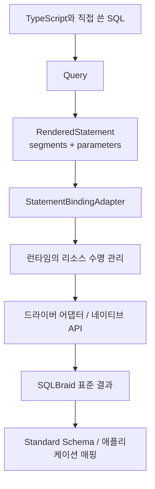
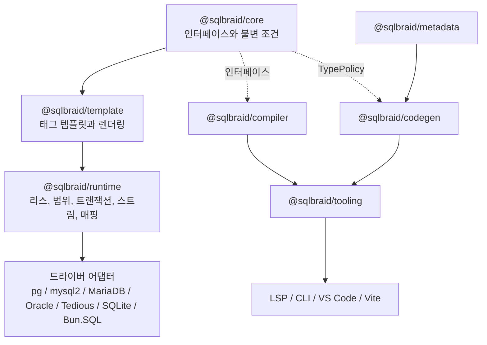
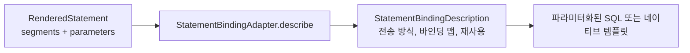
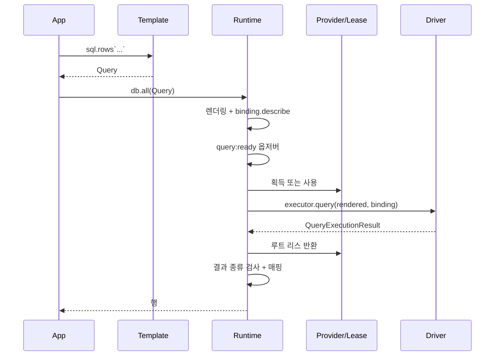

# SQLBraid 기여자를 위한 구조 안내

[English](./mental-model.md)

이 문서는 기여자에게 SQLBraid의 내부 구조를 짧게 소개합니다. 코드를 읽는 순서와 설계의 큰 그림을 담았습니다. 공개 API 감사 문서, 드라이버 작성 가이드, 지원 기록, 테스트를 대신하지는 않습니다.

## 1. 한눈에 보는 구조

SQLBraid는 사용자가 쓴 SQL을 감추지 않습니다. 그리고 데이터베이스 라이브러리가 흔히 한데 섞는 책임을 서로 나눕니다.


```mermaid
flowchart TB
  A[TypeScript와 직접 쓴 SQL] --> Q[Query]
  Q --> R[RenderedStatement<br/>segments + parameters]
  R --> B[StatementBindingAdapter]
  B --> X[런타임의 리소스 수명 관리]
  X --> D[드라이버 어댑터 / 네이티브 API]
  D --> C[SQLBraid 표준 결과]
  C --> M[Standard Schema / 애플리케이션 매핑]
```

실행 코어는 네 계층으로 되어 있습니다.


```mermaid
flowchart TB
  CORE["@sqlbraid/core<br/>인터페이스와 불변 조건"]
  TEMPLATE["@sqlbraid/template<br/>태그 템플릿과 렌더링"]
  RUNTIME["@sqlbraid/runtime<br/>리스, 범위, 트랜잭션, 스트림, 매핑"]
  ADAPTERS["드라이버 어댑터<br/>pg / mysql2 / MariaDB / Oracle / Tedious / SQLite / Bun.SQL"]
  CORE --> TEMPLATE --> RUNTIME --> ADAPTERS

  COMPILER["@sqlbraid/compiler"]
  METADATA["@sqlbraid/metadata"]
  CODEGEN["@sqlbraid/codegen"]
  TOOLING["@sqlbraid/tooling"]
  LSP["LSP / CLI / VS Code / Vite"]
  COMPILER --> TOOLING --> LSP
  METADATA --> CODEGEN --> TOOLING
  CORE -. 인터페이스 .-> COMPILER
  CORE -. TypePolicy .-> CODEGEN
```

`sqlbraid` 패키지는 주로 다른 패키지를 다시 내보내는 대표 파사드입니다. 구현 코드를 읽을 때는 위의 네 실행 계층부터 보세요.

## 2. 가장 중요한 규칙: SQL 구조와 값은 끝까지 따로 다룹니다

일반 보간은 언제나 값 바인딩입니다.

```ts
const query = sql.rows<User>`
  SELECT id, name
  FROM users
  WHERE id = ${userId}
`;
```

이 시점의 논리 문은 아직 `WHERE id = $1`도, `WHERE id = ?`도, `WHERE id = :1`도 아닙니다. SQL 조각 목록과 파라미터 목록일 뿐입니다.

`RenderedStatement`는 다음 불변 조건을 지킵니다.

```text
segments.length === parameters.length + 1
```

렌더링된 파라미터는 값입니다. 식별자, 중첩 쿼리, 드라이버용 SQL 조각, 플레이스홀더 문자열이 될 수 없습니다.

SQL 구조는 명시적으로 만들어야 합니다. `sql.ident`, `sql.fragment`, `sql.list`, `sql.join`, `sql.empty` 같은 헬퍼를 쓰세요. `sql.raw`는 일부러 열어 둔 탈출구입니다.

이 경계가 있어서 플레이스홀더 문법은 어댑터가 책임집니다. 그래서 같은 SQL 모델을 여러 드라이버에서 쓸 수 있습니다.

## 3. `@sqlbraid/core`: 인터페이스 계층

core 패키지는 작성, 런타임, 어댑터가 함께 쓰는 약속의 모음입니다. 일반적인 구현 모듈이 아닙니다. [`packages/core/src/index.ts`](../packages/core/src/index.ts)는 다시 내보내기만 합니다. 타입은 묶음별로 파일이 나뉘어 있습니다.

| 파일                                                                                                                                                                                                           | 내용                                                                                       |
| -------------------------------------------------------------------------------------------------------------------------------------------------------------------------------------------------------------- | ------------------------------------------------------------------------------------------ |
| [`query.ts`](../packages/core/src/query.ts)                                                                                                                                                                    | 쿼리와 결과 타입: `Query`, `RowQuery`, `CommandQuery`, `CallQuery`, `QueryExecutionResult` |
| [`statement.ts`](../packages/core/src/statement.ts)                                                                                                                                                            | 논리 문 타입: `RenderedStatement`, `RenderedParameter`, `RenderedBulk`                     |
| [`binding.ts`](../packages/core/src/binding.ts)                                                                                                                                                                | 바인딩 SPI: `StatementBindingAdapter`, `StatementBindingDescription`, 재사용·전송 타입     |
| [`executor.ts`](../packages/core/src/executor.ts)                                                                                                                                                              | 물리 실행 SPI: `QueryExecutor`, `ConnectionLease`, `ConnectionProvider`                    |
| [`database.ts`](../packages/core/src/database.ts)                                                                                                                                                              | 애플리케이션용 런타임 API: `Database`, 준비된 쿼리 타입, 실행·트랜잭션 옵션                |
| [`dialect.ts`](../packages/core/src/dialect.ts)                                                                                                                                                                | 방언과 값 표현 타입: `TypePolicy`, `TypeMapping`                                           |
| [`authoring.ts`](../packages/core/src/authoring.ts)                                                                                                                                                            | 작성용 타입: `SqlTag`와 조각                                                               |
| [`observers.ts`](../packages/core/src/observers.ts), [`capabilities.ts`](../packages/core/src/capabilities.ts), [`routine.ts`](../packages/core/src/routine.ts), [`errors.ts`](../packages/core/src/errors.ts) | 옵저버, 기능, 루틴, 공개 오류 타입                                                         |

작은 파일인 [`packages/core/src/driver.ts`](../packages/core/src/driver.ts)에는 드라이버 작성자를 위한 헬퍼가 있습니다. 리소스 정리, 안전한 결과 속성 정의, 세이브포인트 이름 검사를 돕습니다.

### Query는 실제 SQL이 아닙니다

`Query`는 템플릿 IR, 캡처한 값, 선언한 결과 종류, 애플리케이션 매핑용 메타데이터를 담습니다. `query.render()`는 `RenderedStatement`를 만들 뿐입니다. 드라이버를 실행하지 않고, 플레이스홀더 문법도 정하지 않습니다.

## 4. `@sqlbraid/template`: 작성과 렌더링

core 다음에는 template 패키지를 읽으세요. [`packages/template/src/index.ts`](../packages/template/src/index.ts)는 다시 내보내기만 합니다. `createSqlTag()`는 [`tag.ts`](../packages/template/src/tag.ts)에, 렌더러는 [`render.ts`](../packages/template/src/render.ts)에, 컴파일러가 호출하는 함수는 [`compiled.ts`](../packages/template/src/compiled.ts)에 있습니다.

`createSqlTag()`는 방언이 정해진 `sql` 태그를 만듭니다. 이 태그는 변경할 수 없는 `Query` 객체를 만듭니다. 구조 처리가 필요 없는 문이면 템플릿 파싱도 필요할 때까지 미룹니다.

작성 API는 값과 SQL 구조를 구분합니다.

- `${value}` → 값 바인딩
- `sql.ident(name)` → 따옴표로 감싼 식별자
- `sql.fragment` → 조합할 수 있는 명시적 SQL 구조
- `sql.list(values)` → 값 바인딩을 담은 구조적 목록
- `sql.join(fragments)` → 구조 조합
- `sql.raw(text)` → 텍스트를 그대로 SQL 구조로 사용. 신뢰할 수 없는 입력은 넘기지 마세요.
- `sql.bind(value, hint)` → 데이터베이스 파라미터 정보를 명시한 값

조각은 방언에 묶입니다. 다른 방언의 조각을 섞으면 SQLBraid가 거부합니다. 따옴표를 다시 붙이거나 구조를 다르게 해석하지 않습니다.

### 조건부 `@braid` 지시어

`@braid` 지시어로 동적 SQL을 그 자리에서 쓸 수 있습니다: `if`, `choose`, `when`, `otherwise`, `where`, `set`, `trim`. 런타임 렌더러도 IR을 이해합니다. 하지만 JavaScript는 템플릿 안의 식을 바로 평가합니다.

그래서 컴파일러가 조건부 캡처를 변환합니다. 변환하면 비활성 분기의 식은 평가되지 않습니다. `guarded()`와 `capture()` 같은 런타임 헬퍼는 컴파일러가 생성하는 코드가 호출하는 함수입니다. 애플리케이션용 두 번째 쿼리 언어가 아닙니다.

## 5. 바인딩: `$1`, `?`, `:1`, `@p1`이 생기는 곳

`StatementBindingAdapter`는 논리 문과 드라이버 전송 방식 사이의 경계입니다.


```mermaid
flowchart LR
  R[RenderedStatement<br/>segments + parameters] --> S[StatementBindingAdapter.describe]
  S --> B[StatementBindingDescription<br/>전송 방식, 바인딩 맵, 재사용]
  B --> P[파라미터화된 SQL 또는 네이티브 템플릿]
```

바인딩 설명은 부수 효과가 없는 순수 연산이고, 커넥션을 얻기 전에 실행됩니다. 그래서 잘못된 힌트나 전송 규칙, 바인딩 식별 문제는 풀의 리스를 쓰기 전에 실패합니다.

이렇게 나뉘어 있어서 PostgreSQL, MySQL, Oracle, SQL Server, 네이티브 템플릿 전송이 같은 논리 형태를 각자 다른 방식으로 실행할 수 있습니다. 쿼리의 정체성은 바뀌지 않습니다.

## 6. `@sqlbraid/runtime`: 어려운 부분은 수명 관리입니다

런타임 코드의 대부분은 SQL 파싱이 아니라 물리 리소스의 소유권을 다룹니다. 런타임은 다음 파일로 구성됩니다.

| 파일                                                                               | 내용                                                                                                                                           |
| ---------------------------------------------------------------------------------- | ---------------------------------------------------------------------------------------------------------------------------------------------- |
| [`index.ts`](../packages/runtime/src/index.ts)                                     | `createDatabase()`, `createPooledDatabase()`, `createScopedDatabase()`, `prepare()`, `prepareObserved()`, `batch`, `bulk`, `session()`, `tx()` |
| [`operations/materialized.ts`](../packages/runtime/src/operations/materialized.ts) | 결과를 메모리로 모두 읽는 경로: `runPrepared()`, `physical()`, `finalizePhysical()`, `processRows()`                                           |
| [`operations/lease.ts`](../packages/runtime/src/operations/lease.ts)               | 리스 획득: `leaseForUse()`                                                                                                                     |
| [`operations/stream.ts`](../packages/runtime/src/operations/stream.ts)             | 스트림 경로                                                                                                                                    |
| [`state.ts`](../packages/runtime/src/state.ts)                                     | `ScopeState`, 루트·트랜잭션 잠금                                                                                                               |

중심이 되는 생성 함수는 `createScopedDatabase()`입니다. `createDatabase()`와 `createPooledDatabase()`가 모두 이 함수를 씁니다.

결과를 메모리로 모두 읽는 일반 쿼리는 다음 순서로 실행됩니다.

```text
prepareObserved()          렌더링, 바인딩 설명, query:ready 발생
  └─ prepare()
runPrepared()
  ├─ leaseForUse()         리소스 획득 또는 고정
  ├─ physical()            드라이버 I/O
  └─ use.release()         매핑 전에 반환
finalizePhysical()         결과 종류 검사
processRows()              Standard Schema 매핑
```

`db.all(query)` 한 번은 대략 다음 과정을 거칩니다.


```mermaid
sequenceDiagram
  participant App
  participant Template
  participant Runtime
  participant Pool as Provider/Lease
  participant Driver
  App->>Template: sql.rows`...`
  Template-->>App: Query
  App->>Runtime: db.all(Query)
  Runtime->>Runtime: 렌더링 + binding.describe
  Runtime->>Runtime: query:ready 옵저버
  Runtime->>Pool: 획득 또는 사용
  Runtime->>Driver: executor.query(rendered, binding)
  Driver-->>Runtime: QueryExecutionResult
  Runtime->>Pool: 루트 리스 반환
  Runtime->>Runtime: 결과 종류 검사 + 매핑
  Runtime-->>App: 행
```

### 매핑 전에 리스를 먼저 반환합니다

풀을 쓰는 일반 작업에서 SQLBraid는 드라이버 I/O와 결과 읽기가 끝나면 리스를 먼저 반환합니다. 비동기 Standard Schema 매핑은 그 다음에 합니다. 풀 커넥션은 개수가 한정되어 있으므로, 애플리케이션의 검증이나 변환이 커넥션을 붙잡고 있으면 안 됩니다.

스트림은 일부러 다르게 동작합니다. 네이티브 커서나 결과 집합이 물리 리소스를 계속 써야 하기 때문입니다.

## 7. 직접 실행기, 프로바이더, 리스

`createDatabase(executor)`는 이미 연결된 물리 실행 리소스 하나를 감쌉니다. SQLBraid는 이 리소스에 대한 접근을 순서대로 처리합니다. 클라이언트나 데이터베이스를 닫는 일은 SQLBraid의 책임이 아닙니다.

`createPooledDatabase(provider)`는 `ConnectionProvider`를 감쌉니다. 프로바이더는 물리 리스를 내주는 곳입니다. 가짜 커넥션이 아닙니다.

풀을 쓰는 루트 작업은 다음과 같이 진행됩니다.

```text
provider.acquire()
    ↓
ConnectionLease
    ↓
물리 I/O
    ↓
lease.release()
```

`ConnectionLease`는 `QueryExecutor`를 확장하고, 반환과 폐기에 대한 책임을 더합니다. 프로바이더와 리스는 같은 바인딩 정책을 노출해야 합니다.

## 8. 범위 상태와 물리 리소스 소유권

`ScopeState`는 리소스를 안전하게 지키는 런타임 상태 기계입니다.

주요 필드는 다음과 같습니다.

- `tail`: 직접 실행이나 루트에서 하는 일반 물리 작업을 순서대로 처리
- `directBusy`: 루트 작업이 지금 쓰고 있는 직접 리소스를 표시
- `transactionTail`: 고정된 물리 작업과 트랜잭션 제어의 순서를 보장
- `streamUsers` / `pendingStreams`: 살아 있거나 시작 중인 스트림을 추적
- `activeScope`: 지금 유효한 트랜잭션·세이브포인트 핸들을 식별
- `activeSession`: 지금 유효한 세션 핸들을 식별
- `poisoned`: 물리 리소스를 다시 쓸 수 없게 만든 실패를 보관

비동기 컨텍스트와 이 표시들이 함께 작업이 몰래 다른 커넥션으로 넘어가는 것을 막습니다.

## 9. `session()`: 트랜잭션 없이 커넥션을 고정합니다

`db.session(callback)`은 콜백이 실행되는 동안 물리 리소스 하나를 고정합니다. 트랜잭션은 시작하지 않습니다.

풀에서는 다음과 같이 동작합니다.

```text
리스 하나 획득
    ↓
중첩된 세션 작업이 모두 같은 리스를 사용
    ↓
콜백과 범위 안 스트림이 끝나면 반환
```

중첩 세션도 지금 고정된 리소스를 그대로 씁니다. `session.tx()`는 같은 리소스에서 트랜잭션을 시작하고, 리스를 하나 더 얻지 않습니다.

범위가 정해진 `Database`를 콜백 밖으로 가지고 나가면 안 됩니다. 루트 핸들을 써서 커넥션 고정이 깨지는 경우, SQLBraid는 그 작업을 다른 커넥션으로 돌리지 않고 거부합니다.

트랜잭션까지는 필요 없지만 커넥션에 묶인 상태가 중요하다면 세션을 쓰세요.

## 10. `tx()`: 물리 트랜잭션 하나, 중첩은 세이브포인트

바깥쪽 `db.tx(callback)`은 물리 리소스 하나를 얻거나 다시 씁니다. 트랜잭션을 시작하고 콜백을 실행한 뒤, 같은 리소스에서 커밋하거나 롤백합니다.

중첩된 `tx.tx(callback)`은 독립된 트랜잭션이 아닙니다. 같은 물리 리소스의 세이브포인트입니다.

```text
SAVEPOINT
callback
RELEASE SAVEPOINT
```

콜백이 실패하면 SQLBraid는 세이브포인트까지 롤백합니다. 리소스가 정상이면 이어서 세이브포인트를 해제합니다.

중첩된 `tx(options, callback)`은 거부됩니다. 격리 수준과 접근 모드는 바깥쪽 물리 트랜잭션에 속합니다. 이미 진행 중인 트랜잭션 안에서 이를 바꾸는 동작을 SQLBraid가 지어내지 않습니다.

중첩 세이브포인트가 활성 상태일 때는 가장 안쪽 콜백 핸들을 쓰세요. 바깥쪽이나 루트 핸들을 쓰면 범위를 벗어나는 것이므로 거부됩니다.

## 11. 스트림은 순회가 끝날 때까지 리스를 소유합니다

`db.stream()`은 `all()`의 결과를 버퍼에 담아 흉내 내는 기능이 아닙니다. 살아 있는 네이티브 커서, 포털, 결과 집합, 요청, 문은 물리 리소스를 계속 씁니다.


```mermaid
flowchart LR
  A[리소스 획득 / 고정] --> B[드라이버 스트림 열기]
  B --> C[행 전달]
  C --> D[iterator.return / 네이티브 정리]
  D --> E[리소스 반환 또는 폐기]
```

조기 `break`, 예외, 취소, 매핑 실패는 모두 정리 단계로 이어집니다. 드라이버 반복자 정리는 리스 반환보다 먼저 일어납니다.

고정된 스트림이 살아 있는 동안에는 같은 리소스에 대한 충돌하는 재진입을 막습니다. 트랜잭션과 세이브포인트 전환도 막습니다. 드라이버가 정의하지 않은 동작에 기대지 않고 SQLBraid가 거부합니다.

## 12. 준비된 쿼리, 배치, 벌크

### 준비된 쿼리

`db.prepare()`가 보장하는 것은 SQLBraid 논리 형태의 안정성입니다. 데이터베이스 서버의 준비된 문 캐시에 항목이 생긴다는 약속은 아닙니다.

첫 실행이 형태를 정합니다: 결과 종류, 정규화된 조각, 순서가 있는 파라미터 정보, 방언. 값은 바뀌어도 됩니다. 구조가 바뀌면 드라이버 I/O 전에 `BRAID_PREPARED_SHAPE`로 실패합니다.

네이티브 또는 서버 쪽 재사용 여부는 어댑터가 따로 정합니다.

### 배치

`db.batch()`는 다음 순서로 동작합니다.

1. 실행할 쿼리 여러 개를 준비합니다. 쿼리는 서로 달라도 됩니다.
2. 물리 리소스나 리스 하나를 얻습니다.
3. 쿼리를 차례로 실행합니다.
4. 리소스나 리스를 반환합니다.
5. 결과를 처리합니다.

배치는 트랜잭션이 아닙니다. 원자성이 필요하면 `db.tx(tx => tx.batch(...))`를 쓰세요.

### 벌크

`db.bulk()`는 같은 형태의 명령 하나를 여러 입력 행에 적용합니다. 물리 실행 방식은 어댑터가 고릅니다: `native-bulk`, `pipeline`, `prepared-loop`, `remote-batch`. 방식의 이름이 트랜잭션 원자성을 뜻하지는 않습니다.

## 13. TypePolicy와 Standard Schema는 다른 문제를 풉니다

`TypePolicy`는 드라이버 경계에서 일합니다.

```text
데이터베이스·네이티브 드라이버 값
    ↓
SQLBraid 표준 JavaScript 표현
```

정확한 정수와 소수를 문자열로 다루는 방식, 바이너리 값, 날짜·시간 프로필, JSON 표현 정책이 여기에 속합니다.

Standard Schema는 애플리케이션 매핑 경계에서 일합니다.

```text
표준 JavaScript 표현
    ↓
애플리케이션·도메인 값
```

예를 들어 정확한 소수 문자열을 애플리케이션의 Decimal이나 Money 타입으로 바꾸는 일은 애플리케이션 매핑입니다. 드라이버 전송 정책이 아닙니다.

두 계층이 나뉘어 있어서 런타임에 범용 입출력 코덱이 필요하지 않습니다.

## 14. 드라이버 어댑터: 얇은 물리 연결층

첫 참고 어댑터로 [`packages/postgres/src/pg.ts`](../packages/postgres/src/pg.ts)를 읽으세요. 그 다음 리소스를 많이 다루는 Oracle 어댑터를 읽으세요.

드라이버 어댑터가 하는 주요 일은 네 가지입니다.

1. `StatementBindingAdapter`를 구현합니다.
2. `QueryExecutor`와, 필요하면 풀·프로바이더 리스를 구현합니다.
3. 네이티브 결과를 SQLBraid의 행, 명령, 루틴 타입으로 정규화합니다.
4. 실행 환경, 기능, 값 표현에 대한 근거를 정직하게 보고합니다.

`PgClientLike` 같은 `*Like` 인터페이스는 네이티브 드라이버 API 중 SQLBraid가 실제로 쓰는 부분만 작게 정의한 것입니다. 드라이버를 대신하는 새 추상화가 아닙니다.

### 방언, 드라이버, 런타임은 서로 다릅니다

```text
방언     = SQL 따옴표 규칙, 어휘·구조 동작
드라이버 = 프로토콜·API 연결, 결과 정규화
런타임   = Node, Bun, Deno, 브라우저, Worker
```

그래서 PostgreSQL을 지원하는 드라이버가 늘어도 PostgreSQL 방언 로직을 복제할 필요가 없습니다. 같은 이유로 SQLite는 방언 하나에 실행 어댑터가 여러 개입니다.

## 15. 오류, 정리, 사용 불가 리소스

SQLBraid는 처음 발생한 실패를 보존합니다. 그러면서도 자신이 소유한 리소스는 끝까지 정리하려고 합니다. 필요한 곳에서는 드라이버 리소스를 LIFO 순서로 정리합니다. 정리 중 생긴 실패는 모아서 함께 알리고, 원래 오류를 가리지 않습니다.

트랜잭션 제어, 스트림 정리, 취소, 리스 정리 때문에 물리 리소스의 상태를 믿을 수 없게 되면 그 리소스를 사용 불가로 표시합니다.

- 풀의 리스라면 다시 쓰도록 반환하지 않고 폐기합니다.
- 직접 리소스라면 이후의 SQLBraid 작업을 모두 거부합니다.

커넥션을 낙관적으로 재사용하는 것보다 정확성이 우선입니다.

## 16. 옵저버와 기능

`ExecutionObserver`는 관찰하거나 실패시키는 일만 할 수 있습니다. 수명 주기 이벤트를 살펴보고 예외를 던질 수는 있지만, SQL, 바인딩, 결과, 라우팅, 재시도, 트랜잭션 대상을 바꿀 수는 없습니다.

기능(capability)은 어댑터나 리소스가 실제로 할 수 있는 일을 나타냅니다. 물리적으로 없는 동작을 SQLBraid가 몰래 흉내 내지 않습니다. 예를 들어 진짜 스트리밍 프로토콜이 없는 어댑터는 `db.stream()`을 거부합니다. 결과 전체를 버퍼에 담은 뒤 스트리밍한 것처럼 보이게 하지 않습니다.

선택 사항인 OpenTelemetry 패키지도 런타임을 고치지 않고 이 옵저버 API로 연결됩니다.

## 17. 정적 도구는 별도 영역입니다

런타임 코어는 메타데이터, 컴파일러, 코드 생성, CLI, 에디터, Vite 패키지에 의존하지 않습니다. 의도한 설계입니다.

- `@sqlbraid/metadata`는 데이터베이스에 대한 근거를 기록합니다.
- `@sqlbraid/codegen`은 오프라인에서 동작하는 순수 변환입니다: 메타데이터 + TypePolicy → TypeScript 모델
- `@sqlbraid/compiler`는 소스 탐색과 변환을 맡습니다.
- `@sqlbraid/tooling`은 컴파일러, 메타데이터, 코드 생성에서 나온 근거를 모아 CLI, LSP, 에디터에 제공합니다.

메타데이터에 정보가 없다는 것은 아직 확인하지 못했다는 뜻일 뿐입니다. 사용자의 SQL이 잘못되었다는 증거가 아닙니다.

## 18. 권장 소스 읽기 순서

저장소를 알파벳 순서로 읽지 마세요. 다음 순서를 권합니다.

1. README의 "Key Concepts"와 "Runtime API" 절
2. `packages/core/src/`: `statement.ts` (`RenderedStatement`), `query.ts` (`Query`), `binding.ts` (`StatementBindingAdapter`), `executor.ts` (`QueryExecutor`, `ConnectionProvider`), `database.ts` (`Database`), `authoring.ts` (`SqlTag`)
3. `packages/template/src/`: `tag.ts` (`createSqlTag()`) → `render.ts` (`renderTemplateIr()` / `renderNodes()`)
4. `packages/runtime/src/index.ts`: `createDatabase` / `createPooledDatabase` → `createScopedDatabase` → `prepareObserved` → `prepare`. 이어서 `operations/materialized.ts`: `runPrepared` → `leaseForUse` (`operations/lease.ts`) → `physical` → `finalizePhysical` → `processRows`
5. `operations/stream.ts`의 스트림 경로 (따로 읽기)
6. `index.ts`의 `session()`과 `tx()`
7. 첫 어댑터로 `packages/postgres/src/pg.ts`의 `pgStatementBinding`과 `createPgExecutor()`
8. Oracle처럼 리소스를 많이 다루는 어댑터
9. 정적 도구를 다룰 때만: 컴파일러 → 메타데이터 → 코드 생성 → 도구

## 19. 기여자가 지켜야 할 불변 조건

구조를 바꾸기 전에 다음 규칙이 그대로 유지되는지 확인하세요.

- 일반 보간은 계속 값 바인딩입니다.
- SQL 구조는 명시적입니다.
- 논리 문의 형태는 전송 방식에 의존하지 않습니다.
- 바인딩 설명은 순수 연산이며 리소스 획득 전에 실행됩니다.
- 프로바이더와 리스의 바인딩 정체성은 같습니다.
- 풀에서 메모리로 모두 읽는 결과는 애플리케이션 매핑 전에 리스를 반환합니다.
- 스트림은 네이티브 반복자 정리가 끝날 때까지 리소스를 유지합니다.
- 세션은 트랜잭션을 몰래 시작하지 않고 리소스만 고정합니다.
- 중첩 트랜잭션은 같은 물리 리소스의 세이브포인트입니다.
- 루트나 바깥쪽 범위로 벗어나는 작업은 다른 경로로 돌리지 않고 거부합니다.
- 정리는 소유한 리소스를 모두 시도하고, 처음 실패를 보존합니다.
- 상태를 믿을 수 없는 물리 리소스는 사용 불가로 표시하거나 폐기합니다.
- 지원하지 않는 기능은 흉내 내지 않고 명시적으로 실패합니다.
- 전송 표현은 TypePolicy가, 애플리케이션 매핑은 Standard Schema가 맡습니다.
- 옵저버는 관찰하거나 실패시킬 뿐, 실행을 바꾸지 않습니다.
- 런타임은 컴파일러, 메타데이터, 코드 생성, 도구에 의존하지 않습니다.

## 20. 변경 사항을 어디에 둘까요

- 공개 인터페이스 / SPI → `@sqlbraid/core`
- 태그 템플릿 구조와 렌더링 → `@sqlbraid/template`
- 리스, 범위, 트랜잭션, 스트림, 매핑 → `@sqlbraid/runtime`
- 플레이스홀더, 네이티브 프로토콜, 결과 정규화 → 드라이버 어댑터
- 데이터베이스 기본 타입의 값 표현 → 방언·드라이버의 TypePolicy
- 스키마 정보 → `@sqlbraid/metadata`와 인스펙터
- 생성되는 TypeScript 모델 → `@sqlbraid/codegen`
- 소스 변환과 타입 오버레이 → `@sqlbraid/compiler`
- 호버, 자동 완성, 워크스페이스, LSP 근거 → tooling / language-server
- 추적과 지표 → `@sqlbraid/opentelemetry` 같은 옵저버 확장

여러 경계를 한꺼번에 넘나들어야 할 것 같은 변경이라면, 먼저 더 작고 명시적인 규칙으로 표현할 수 있는지 살펴보세요. SQLBraid는 숨겨진 의미 처리 장치보다 명시적인 경계를 일부러 선택합니다.

## 관련 문서

- [공개 API 감사](./public-api-audit.md)
- [드라이버 작성 가이드](./driver-author-guide.md)
- [릴리스 준비 상태](./SQLBraid_release_readiness.md)
- [글쓰기 스타일](./writing-style.md)
- [저장소 규칙](../AGENTS.md)
