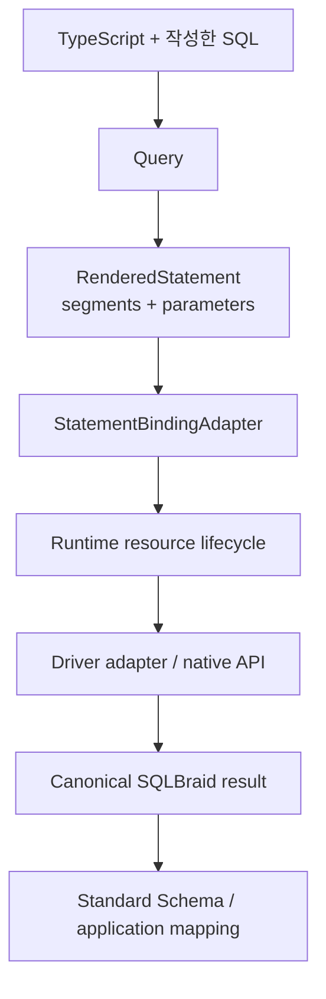
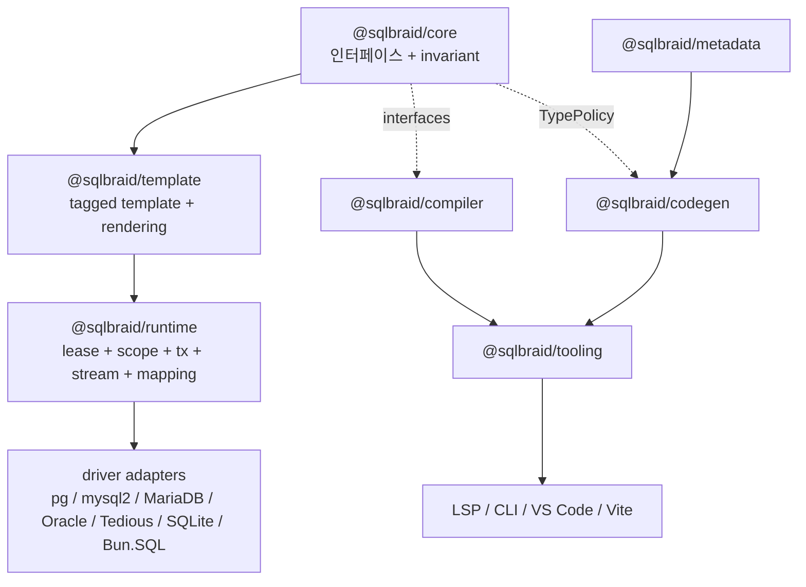
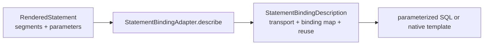
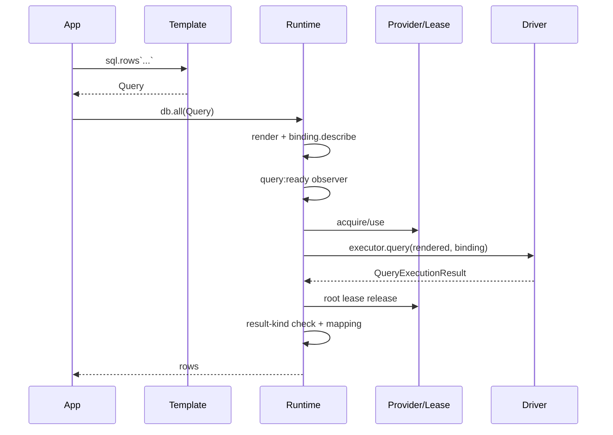
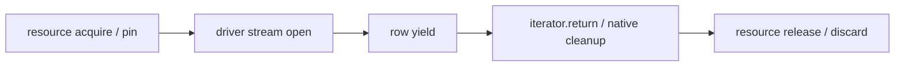

# SQLBraid 기여자용 멘탈 모델

[English](./mental-model.md)

이 문서는 기여자에게 SQLBraid 내부 구조를 짧게 설명합니다. 읽기 지도이자 설계 모델입니다. Public API audit, driver-author guide, support record, 테스트를 대체하지 않습니다.

## 1. 전체 구조 한눈에 보기

SQLBraid는 사용자가 작성한 SQL을 그대로 보이게 유지합니다. 그리고 데이터 접근 라이브러리에서 흔히 섞이는 책임을 분리합니다.


```mermaid
flowchart TB
  A[TypeScript + 작성한 SQL] --> Q[Query]
  Q --> R[RenderedStatement<br/>segments + parameters]
  R --> B[StatementBindingAdapter]
  B --> X[Runtime resource lifecycle]
  X --> D[Driver adapter / native API]
  D --> C[Canonical SQLBraid result]
  C --> M[Standard Schema / application mapping]
```

실행 코어는 4개 층으로 구성됩니다.


```mermaid
flowchart TB
  CORE["@sqlbraid/core<br/>인터페이스 + invariant"]
  TEMPLATE["@sqlbraid/template<br/>tagged template + rendering"]
  RUNTIME["@sqlbraid/runtime<br/>lease + scope + tx + stream + mapping"]
  ADAPTERS["driver adapters<br/>pg / mysql2 / MariaDB / Oracle / Tedious / SQLite / Bun.SQL"]
  CORE --> TEMPLATE --> RUNTIME --> ADAPTERS

  COMPILER["@sqlbraid/compiler"]
  METADATA["@sqlbraid/metadata"]
  CODEGEN["@sqlbraid/codegen"]
  TOOLING["@sqlbraid/tooling"]
  LSP["LSP / CLI / VS Code / Vite"]
  COMPILER --> TOOLING --> LSP
  METADATA --> CODEGEN --> TOOLING
  CORE -. interfaces .-> COMPILER
  CORE -. TypePolicy .-> CODEGEN
```

`sqlbraid` 패키지는 주로 canonical facade입니다. 다른 패키지를 re-export합니다. 구현 코드를 읽을 때는 위 4개 실행 계층에서 시작하세요.

## 2. 가장 중요한 invariant: SQL 구조와 값은 끝까지 분리한다

일반 interpolation은 항상 value bind입니다.

```ts
const query = sql.rows<User>`
  SELECT id, name
  FROM users
  WHERE id = ${userId}
`;
```

이 시점의 논리 statement는 아직 `WHERE id = $1`, `WHERE id = ?`, `WHERE id = :1`이 아닙니다. SQL segment와 parameter의 조합으로 표현됩니다.

`RenderedStatement`는 다음 invariant를 유지합니다.

```text
segments.length === parameters.length + 1
```

rendered parameter는 값입니다. identifier, nested query, raw driver fragment, placeholder 문자열이 아닙니다.

SQL 구조는 명시적이어야 합니다. `sql.ident`, `sql.fragment`, `sql.list`, `sql.join`, `sql.empty` 같은 헬퍼를 사용하세요. `sql.raw`는 의도적인 escape hatch입니다.

이 경계 덕분에 adapter가 placeholder 문법을 소유합니다. 그래서 같은 SQL 모델을 서로 다른 driver로 보낼 수 있습니다.

## 3. `@sqlbraid/core`: 인터페이스 계층

가장 중요한 소스 파일은 [`packages/core/src/index.ts`](../packages/core/src/index.ts)입니다. 이 파일을 authoring, runtime, adapter가 공유하는 protocol로 취급하세요. 일반 구현 모듈이 아닙니다.

주요 영역은 다음과 같습니다.

- query/result 타입: `Query`, `RowQuery`, `CommandQuery`, `CallQuery`, `QueryExecutionResult`;
- 논리 statement 타입: `RenderedStatement`, `RenderedParameter`, `RenderedBulk`;
- binding SPI: `StatementBindingAdapter`, `StatementBindingDescription`, reuse/transport 타입;
- 물리 실행 SPI: `QueryExecutor`, `ConnectionLease`, `ConnectionProvider`;
- application runtime surface: `Database`, prepared query 타입, execution/transaction option;
- 표현 타입: `TypePolicy`, `TypeMapping`;
- observer, capability, routine, public error 타입.

더 작은 파일 [`packages/core/src/driver.ts`](../packages/core/src/driver.ts)에는 driver 작성자용 helper가 있습니다. resource cleanup, 안전한 result property, 생성된 savepoint 이름을 돕습니다.

### Query는 물리 SQL이 아니다

`Query`는 template IR, capture된 값, 선언된 result kind, 선택적 application mapping metadata를 보관합니다. `query.render()`는 `RenderedStatement`를 만듭니다. driver를 실행하지 않습니다. native placeholder 문법도 정하지 않습니다.

## 4. `@sqlbraid/template`: SQL 작성과 rendering

core 다음에는 [`packages/template/src/index.ts`](../packages/template/src/index.ts)를 읽습니다.

`createSqlTag()`는 dialect-bound `sql` tag를 만듭니다. 이 tag는 frozen `Query` 객체를 생성합니다. statement에 구조 처리가 필요 없으면 template parsing을 늦춥니다.

authoring surface는 값과 SQL 구조를 명확히 구분합니다.

- `${value}` → value bind;
- `sql.ident(name)` → quoted identifier 구조;
- `sql.fragment` → 명시적인 composable SQL 구조;
- `sql.list(values)` → value bind를 포함하는 structural list;
- `sql.join(fragments)` → structural composition;
- `sql.raw(text)` → text를 그대로 SQL 구조로 사용; 신뢰할 수 없는 입력을 넘기면 안 됨;
- `sql.bind(value, hint)` → 값 + 명시적인 DB parameter metadata.

fragment는 dialect에 종속됩니다. SQLBraid는 다른 dialect의 fragment를 거부합니다. 임의로 다시 quote하거나 구조를 다르게 해석하지 않습니다.

### Guarded `@braid` directive

`@braid` directive는 local dynamic SQL을 제공합니다: `if`, `choose`, `when`, `otherwise`, `where`, `set`, `trim`. runtime renderer는 IR을 이해합니다. 하지만 JavaScript는 일반 template expression을 즉시 평가합니다.

따라서 compiler는 guarded capture를 lower합니다. 그러면 inactive branch 안의 expression은 평가되지 않습니다. `guarded()`와 `capture()`는 compiler의 target입니다. application용 두 번째 query language가 아닙니다.

## 5. Binding: `$1`, `?`, `:1`, `@p1`이 처음 등장하는 지점

`StatementBindingAdapter`가 논리 statement와 driver transport 사이의 경계입니다.


```mermaid
flowchart LR
  R[RenderedStatement<br/>segments + parameters] --> S[StatementBindingAdapter.describe]
  S --> B[StatementBindingDescription<br/>transport + binding map + reuse]
  B --> P[parameterized SQL or native template]
```

binding description은 pure operation입니다. connection acquisition 전에 수행됩니다. 따라서 잘못된 hint, transport 규칙, binding identity는 pool lease를 쓰기 전에 실패합니다.

이 분리 덕분에 PostgreSQL, MySQL, Oracle, SQL Server, native template transport는 같은 논리 shape을 서로 다른 방식으로 materialize할 수 있습니다. query identity는 바뀌지 않습니다.

## 6. `@sqlbraid/runtime`: 어려운 부분은 SQL이 아니라 lifecycle

runtime의 중심 파일은 [`packages/runtime/src/index.ts`](../packages/runtime/src/index.ts)입니다. 파일이 큰 이유는 대부분 physical resource ownership 때문입니다. SQL parsing 때문이 아닙니다.

중심 생성 함수는 `createScopedDatabase()`입니다. `createDatabase()`와 `createPooledDatabase()` 모두 이 함수를 사용합니다.

일반 materialized query는 다음 순서로 함수를 읽으세요.

```text
prepareObserved()
    ↓
prepare()
    ↓
runPrepared()
    ↓
physical()
    ↓
finalizePhysical()
    ↓
processRows()
```

`db.all(query)` 한 번은 대략 다음 lifecycle을 거칩니다.


```mermaid
sequenceDiagram
  participant App
  participant Template
  participant Runtime
  participant Pool as Provider/Lease
  participant Driver
  App->>Template: sql.rows`...`
  Template-->>App: Query
  App->>Runtime: db.all(Query)
  Runtime->>Runtime: render + binding.describe
  Runtime->>Runtime: query:ready observer
  Runtime->>Pool: acquire/use
  Runtime->>Driver: executor.query(rendered, binding)
  Driver-->>Runtime: QueryExecutionResult
  Runtime->>Pool: root lease release
  Runtime->>Runtime: result-kind check + mapping
  Runtime-->>App: rows
```

### application mapping 전에 lease를 먼저 반환한다

pooled materialized operation에서 SQLBraid는 driver I/O와 result materialization 후에 lease를 반환합니다. 그 다음에 비동기 Standard Schema mapping을 수행합니다. application validation/transformation이 pool connection을 붙잡으면 안 됩니다. pool connection은 수가 제한되어 있기 때문입니다.

stream은 의도적으로 다르게 처리합니다. native cursor/result set이 physical resource를 계속 필요로 하기 때문입니다.

## 7. Direct executor, provider, lease

`createDatabase(executor)`는 이미 존재하는 physical execution resource 하나를 감쌉니다. SQLBraid는 접근을 직렬화합니다. client/database의 shutdown은 SQLBraid가 소유하지 않습니다.

`createPooledDatabase(provider)`는 `ConnectionProvider`를 감쌉니다. provider는 physical lease의 공급원입니다. 가짜 connection이 아닙니다.

pooled root materialized operation은 다음과 같습니다.

```text
provider.acquire()
    ↓
ConnectionLease
    ↓
physical I/O
    ↓
lease.release()
```

`ConnectionLease`는 `QueryExecutor`를 확장합니다. release/discard ownership을 추가합니다. provider와 lease는 같은 statement-binding policy를 노출해야 합니다.

## 8. Scope state와 physical ownership

`ScopeState`는 runtime의 resource safety state machine입니다.

중요 필드는 다음과 같습니다.

- `tail`: direct/root의 일반 physical work 직렬화;
- `transactionTail`: pinned physical work와 transaction-control transition의 순서 보장;
- `streamUsers` / `pendingStreams`: 살아 있거나 admission 중인 stream 추적;
- `activeScope`: 현재 유효한 transaction/savepoint handle 식별;
- `activeSession`: 현재 유효한 session handle 식별;
- `poisoned`: 해당 physical resource를 재사용할 수 없게 만든 failure 보존.

async context와 이 marker들은 작업이 조용히 다른 connection으로 빠져나가는 것을 막습니다.

## 9. `session()`: transaction 없이 connection을 pin한다

`db.session(callback)`은 callback 동안 physical resource 하나를 고정합니다. transaction은 시작하지 않습니다.

pool에서는:

```text
lease 하나 acquire
    ↓
nested session operation 전체가 동일 lease 재사용
    ↓
callback/scoped stream 종료 후 release
```

nested session도 현재 pinned resource를 재사용합니다. `session.tx()`는 같은 resource에서 transaction을 시작합니다. 두 번째 lease를 가져오지 않습니다.

scoped `Database`는 callback 밖으로 escape하면 안 됩니다. root handle 사용이 physical affinity를 깨뜨린다면 SQLBraid는 그 사용을 거부합니다. 다른 connection으로 우회시키지 않습니다.

correctness가 connection-local state에 의존하지만 transaction은 꼭 필요하지 않을 때 session을 사용하세요.

## 10. `tx()`: 하나의 physical transaction, nested는 savepoint

outer `db.tx(callback)`은 physical resource 하나를 acquire하거나 reuse합니다. transaction을 시작하고 callback을 실행합니다. 그 다음 같은 resource에서 commit 또는 rollback합니다.

nested `tx.tx(callback)`은 독립 transaction이 아닙니다. 같은 physical resource의 savepoint입니다.

```text
SAVEPOINT
callback
RELEASE SAVEPOINT
```

callback이 실패하면 SQLBraid는 savepoint까지 rollback합니다. resource가 정상이면 그 다음 savepoint를 release합니다.

SQLBraid는 nested `tx(options, callback)`을 거부합니다. isolation/access option은 outer physical transaction에 속합니다. SQLBraid는 활성 transaction 안에서 이 option을 바꾸는 의미를 만들지 않습니다.

nested savepoint가 활성 상태이면 가장 안쪽 callback handle을 사용하세요. SQLBraid는 parent/root handle 사용을 거부합니다. 이것은 scope escape를 막습니다.

## 11. Stream은 iteration이 끝날 때까지 lease를 소유한다

`db.stream()`은 `all()`을 buffer한 가짜 stream이 아닙니다. 살아 있는 native cursor, portal, result set, request, statement는 physical resource를 계속 점유합니다.


```mermaid
flowchart LR
  A[resource acquire / pin] --> B[driver stream open]
  B --> C[row yield]
  C --> D[iterator.return / native cleanup]
  D --> E[resource release / discard]
```

early `break`, exception, cancellation, mapping failure는 모두 cleanup을 시작합니다. driver iterator cleanup은 lease release보다 먼저 수행됩니다.

살아 있는 pinned stream은 같은 resource에 대한 충돌하는 re-entry를 막습니다. transaction/savepoint transition도 막습니다. SQLBraid는 그 작업을 거부합니다. driver가 정의하지 않은 동작에 의존하지 않습니다.

## 12. Prepared query, batch, bulk

### Prepared query

`db.prepare()`는 SQLBraid의 안정된 logical shape을 뜻합니다. DB server에 prepared statement cache entry가 생긴다는 약속이 아닙니다.

첫 실행이 shape을 확정합니다: result kind, canonical segment, 순서가 있는 parameter metadata, dialect. 값은 바뀔 수 있습니다. 구조가 바뀌면 driver I/O 전에 `BRAID_PREPARED_SHAPE`로 실패합니다.

실제 native/server reuse 여부는 별도로 adapter가 결정합니다.

### Batch

`db.batch()`는 다음 단계를 수행합니다.

1. 여러 executable query를 prepare합니다. query는 서로 달라도 됩니다.
2. physical use/lease 하나를 얻습니다.
3. query를 순서대로 실행합니다.
4. use/lease를 release합니다.
5. result를 처리합니다.

batch는 transaction이 아닙니다. atomicity가 필요하면 `db.tx(tx => tx.batch(...))`를 사용하세요.

### Bulk

`db.bulk()`는 하나의 homogeneous command shape에 여러 input row를 적용합니다. adapter가 physical 전략을 선택합니다: `native-bulk`, `pipeline`, `prepared-loop`, `remote-batch`. 전략 이름은 transaction atomicity를 뜻하지 않습니다.

## 13. TypePolicy와 Standard Schema는 서로 다른 문제를 해결한다

`TypePolicy`는 driver boundary의 책임입니다.

```text
database/native driver value
    ↓
SQLBraid canonical JavaScript representation
```

exact integer/decimal의 문자열 표현, binary, temporal profile, JSON representation 같은 문제가 여기에 속합니다.

Standard Schema는 application mapping boundary의 책임입니다.

```text
canonical JavaScript representation
    ↓
application/domain value
```

예를 들어 exact decimal 문자열을 application의 Decimal/Money 객체로 바꾸는 것은 application mapping이지 driver transport policy가 아닙니다.

이 계층을 분리했기 때문에 runtime에 universal input/output codec framework를 넣을 필요가 없습니다.

## 14. Driver adapter: 얇은 physical bridge

첫 reference adapter로 [`packages/postgres/src/pg.ts`](../packages/postgres/src/pg.ts)를 읽으세요. 그 다음 resource가 많은 Oracle adapter를 읽으세요.

driver adapter의 주요 책임은 네 가지입니다.

1. `StatementBindingAdapter` 구현;
2. `QueryExecutor` 및 필요한 pool/provider lease 구현;
3. native result를 SQLBraid row/command/routine 타입으로 normalize;
4. environment/capability/representation evidence를 정직하게 보고.

`PgClientLike` 같은 `*Like` interface는 native driver API 중 SQLBraid가 실제 사용하는 작은 structural subset입니다. 새로운 driver abstraction을 만들려는 것이 아닙니다.

### Dialect, driver, runtime은 서로 다른 축이다

```text
dialect  = SQL quoting, lexical/structural behavior
driver   = protocol/API bridge, result normalization
runtime  = Node, Bun, Deno, browser, Worker
```

따라서 PostgreSQL driver마다 PostgreSQL dialect 로직을 복제할 필요가 없습니다. 같은 이유로 SQLite에는 dialect 하나와 execution adapter 여러 개가 있습니다.

## 15. Error, cleanup, poisoned resource

SQLBraid는 primary failure를 보존합니다. 그리고 자신이 소유한 resource의 cleanup을 끝까지 시도합니다. 필요한 곳에서 driver resource cleanup은 LIFO scope를 사용합니다. cleanup failure는 aggregate합니다. 원래 error를 가리지 않습니다.

transaction control, stream cleanup, cancellation, lease cleanup 결과로 physical resource 상태를 신뢰할 수 없게 되면 resource를 poison합니다.

- pooled lease는 pool로 정상 반환하지 않고 discard;
- direct poisoned resource는 이후 SQLBraid work를 거부.

낙관적인 connection 재사용보다 correctness를 우선합니다.

## 16. Observer와 capability

`ExecutionObserver`는 observe 또는 fail만 할 수 있습니다. lifecycle event를 볼 수 있고 throw할 수 있습니다. SQL, bind, result, routing, retry, transaction target은 rewrite할 수 없습니다.

capability는 adapter/resource가 실제로 지원하는 일을 표현합니다. SQLBraid는 빠진 physical semantic을 조용히 흉내 내지 않습니다. 예를 들어 실제 streaming protocol이 없는 adapter는 `db.stream()`을 거부합니다. 전체 result를 buffer한 뒤 stream인 것처럼 내보내지 않습니다.

optional OpenTelemetry package도 runtime을 patch하지 않고 이 observer surface로 연결됩니다.

## 17. Static/tooling subsystem은 실행 core와 분리되어 있다

runtime core는 의도적으로 metadata, compiler, codegen, CLI, editor, Vite 패키지에 의존하지 않습니다.

- `@sqlbraid/metadata`는 DB evidence를 기록합니다.
- `@sqlbraid/codegen`은 pure/offline 변환입니다: metadata + TypePolicy → TypeScript model.
- `@sqlbraid/compiler`는 source discovery/lowering을 소유합니다.
- `@sqlbraid/tooling`은 compiler/metadata/codegen의 positive evidence를 합쳐 CLI/LSP/editor에 제공합니다.

metadata에 없는 사실은 unresolved evidence입니다. 사용자의 SQL이 invalid라는 증거가 아닙니다.

## 18. 권장 소스 읽기 순서

repository를 알파벳 순서로 읽지 마세요. 다음 순서를 사용하세요.

1. README의 core boundary, session, prepared query;
2. `packages/core/src/index.ts`에서 `RenderedStatement`, `Query`, `StatementBindingAdapter`, `QueryExecutor`, `ConnectionProvider`, `Database`, `SqlTag`;
3. `packages/template/src/index.ts`의 `createSqlTag()` → `renderTemplateIr()` / `renderNodes()`;
4. `packages/runtime/src/index.ts`의 `createDatabase` / `createPooledDatabase` → `createScopedDatabase` → `prepare` → `leaseForUse` → `physical` → `runPrepared` → `finalizePhysical` → `processRows`;
5. runtime의 `stream()`을 별도로 읽기;
6. runtime의 `session()`과 `tx()`;
7. 첫 adapter로 PostgreSQL의 `pgStatementBinding`과 `createPgExecutor()`;
8. Oracle 또는 resource lifecycle이 복잡한 adapter;
9. static tooling 작업을 할 때만 compiler → metadata → codegen → tooling.

## 19. 기여자가 보호해야 할 invariant

architecture를 바꾸기 전에 다음 규칙이 유지되는지 확인합니다.

- ordinary interpolation은 계속 value bind여야 함;
- SQL structure는 명시적이어야 함;
- logical statement shape은 transport-neutral이어야 함;
- binding description은 pure/pre-acquire여야 함;
- provider와 lease의 binding identity가 일치해야 함;
- materialized pooled result는 application mapping 전에 lease를 반환해야 함;
- stream은 native iterator cleanup까지 resource를 유지해야 함;
- session은 transaction을 몰래 시작하지 않고 physical resource만 pin해야 함;
- nested transaction은 같은 physical resource의 savepoint여야 함;
- root/parent scope escape는 다른 connection으로 우회하지 말고 거부해야 함;
- cleanup은 소유한 resource를 모두 시도하면서 primary failure를 보존해야 함;
- 상태가 불확실한 physical resource는 poison/discard해야 함;
- unsupported capability는 simulation하지 말고 명시적으로 실패해야 함;
- TypePolicy는 transport representation, Standard Schema는 application mapping을 소유해야 함;
- observer는 observe/fail이며 execution rewrite를 하지 않아야 함;
- runtime은 compiler/metadata/codegen/tooling과 독립적이어야 함.

## 20. 변경사항을 어디에 둘 것인가

- public interface / SPI → `@sqlbraid/core`
- tagged-template 구조/rendering → `@sqlbraid/template`
- lease/scope/transaction/stream/mapping → `@sqlbraid/runtime`
- placeholder/native protocol/result normalization → driver adapter
- DB primitive representation → dialect/driver TypePolicy
- schema fact → `@sqlbraid/metadata` + inspector
- 생성 TypeScript model → `@sqlbraid/codegen`
- source lowering/type overlay → `@sqlbraid/compiler`
- hover/completion/workspace/LSP evidence → tooling/language-server
- tracing/metric → `@sqlbraid/opentelemetry` 같은 observer extension

변경이 여러 경계를 넘는 것처럼 보이면, 먼저 더 작은 명시적 규칙으로 요구사항을 표현할 수 있는지 확인하세요. SQLBraid는 숨겨진 semantic machinery보다 명시적인 경계를 우선합니다. 이것은 의도적인 선택입니다.

## 관련 architecture 문서

- [Public API audit](./public-api-audit.md)
- [Driver-author guide](./driver-author-guide.md)
- [Release readiness](./SQLBraid_release_readiness.md)
- [Writing style](./writing-style.md)
- [Repository rules](../AGENTS.md)
