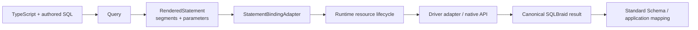
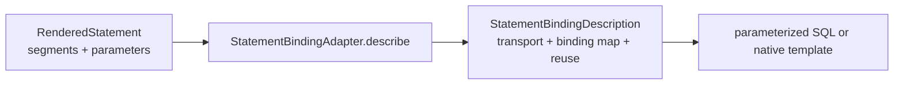
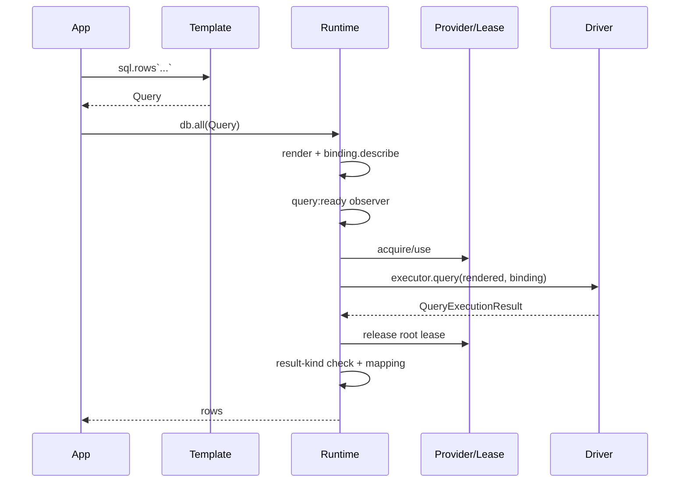
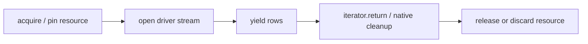

# SQLBraid contributor mental model

[한국어](./mental-model.ko.md)

This guide provides a concise overview of SQLBraid's internal architecture for contributors. It is a reading map and design model, not a replacement for the public API audit, driver-author guide, support records, or tests.

## 1. The architecture at a glance

SQLBraid keeps user-authored SQL visible and separates concerns that database libraries often mix together.



The execution core is easiest to understand as four layers:

```mermaid
flowchart TB
  CORE[@sqlbraid/core<br/>contracts + invariants]
  TEMPLATE[@sqlbraid/template<br/>tagged templates + rendering]
  RUNTIME[@sqlbraid/runtime<br/>leases + scopes + tx + streams + mapping]
  ADAPTERS[driver adapters<br/>pg / mysql2 / MariaDB / Oracle / Tedious / SQLite / Bun.SQL]
  CORE --> TEMPLATE --> RUNTIME --> ADAPTERS

  COMPILER[@sqlbraid/compiler]
  METADATA[@sqlbraid/metadata]
  CODEGEN[@sqlbraid/codegen]
  TOOLING[@sqlbraid/tooling]
  LSP[LSP / CLI / VS Code / Vite]
  COMPILER --> TOOLING --> LSP
  METADATA --> CODEGEN --> TOOLING
  CORE -. contracts .-> COMPILER
  CORE -. TypePolicy .-> CODEGEN
```

The `sqlbraid` package is primarily the canonical facade and re-export surface. Start with the four execution layers above when reading implementation code.

## 2. The central invariant: SQL structure and values stay separate

Ordinary interpolation is always a value bind:

```ts
const query = sql.rows<User>`
  SELECT id, name
  FROM users
  WHERE id = ${userId}
`;
```

The logical statement does not become `WHERE id = $1`, `WHERE id = ?`, or `WHERE id = :1` yet. It is represented as SQL segments plus parameters.

`RenderedStatement` preserves this invariant:

```text
segments.length === parameters.length + 1
```

A rendered parameter is a value. It is not an identifier, nested query, raw driver fragment, or placeholder string.

SQL structure must be explicit through helpers such as `sql.ident`, `sql.fragment`, `sql.list`, `sql.join`, `sql.empty`, or the deliberate escape hatch `sql.raw`.

This boundary is why placeholder syntax can remain adapter-owned and the same authored SQL model can target different drivers.

## 3. `@sqlbraid/core`: the contracts layer

The most important source file is [`packages/core/src/index.ts`](../packages/core/src/index.ts). Treat it as the protocol shared by authoring, runtime, and adapters rather than as a normal implementation module.

Key groups are:

- query/result contracts: `Query`, `RowQuery`, `CommandQuery`, `CallQuery`, `QueryExecutionResult`;
- logical statement contracts: `RenderedStatement`, `RenderedParameter`, `RenderedBulk`;
- binding SPI: `StatementBindingAdapter`, `StatementBindingDescription`, reuse/transport types;
- physical execution SPI: `QueryExecutor`, `ConnectionLease`, `ConnectionProvider`;
- application runtime surface: `Database`, prepared-query types, execution/transaction options;
- representation contracts: `TypePolicy`, `TypeMapping`;
- observer, capability, routine, and public error contracts.

The smaller [`packages/core/src/driver.ts`](../packages/core/src/driver.ts) contains driver-author helpers for resource cleanup, safe result properties, and generated savepoint names.

### Query is not physical SQL

A `Query` retains template IR, captured values, declared result kind, and optional application mapping metadata. `query.render()` produces a `RenderedStatement`; it does not execute a driver and it does not decide native placeholder syntax.

## 4. `@sqlbraid/template`: authoring and rendering

Read [`packages/template/src/index.ts`](../packages/template/src/index.ts) after core.

`createSqlTag()` constructs a dialect-bound `sql` tag. It creates frozen `Query` objects and delays template parsing when the statement does not need structural processing.

The authoring surface distinguishes value data from SQL structure:

- `${value}` → value bind;
- `sql.ident(name)` → quoted identifier structure;
- `sql.fragment` → explicit composable SQL structure;
- `sql.list(values)` → a structural list containing value binds;
- `sql.join(fragments)` → structural composition;
- `sql.raw(text)` → verbatim SQL structure; never pass untrusted input;
- `sql.bind(value, hint)` → value plus explicit database parameter metadata.

Fragments are dialect-bound. Crossing fragment dialects is rejected instead of silently requoting or reinterpreting structure.

### Guarded `@braid` directives

`@braid` directives provide local dynamic SQL (`if`, `choose`, `when`, `otherwise`, `where`, `set`, `trim`). The runtime renderer understands the IR, but ordinary JavaScript template expressions are eager.

The compiler therefore lowers guarded captures so expressions in inactive branches are not evaluated. Runtime helpers such as `guarded()` and `capture()` are compiler targets, not an alternative application query language.

## 5. Binding: where `$1`, `?`, `:1`, and `@p1` appear

`StatementBindingAdapter` is the boundary between a logical statement and a driver transport.



Binding description is pure and occurs before connection acquisition. Invalid hints, transport contracts, or binding identity fail before a pool lease is consumed.

This separation lets PostgreSQL, MySQL, Oracle, SQL Server, and native-template transports materialize the same logical shape differently without changing query identity.

## 6. `@sqlbraid/runtime`: lifecycle is the hard part

The main runtime file is [`packages/runtime/src/index.ts`](../packages/runtime/src/index.ts). Its size mostly comes from physical resource ownership, not SQL parsing.

The central constructor is `createScopedDatabase()`. Both `createDatabase()` and `createPooledDatabase()` eventually use it.

For a normal materialized query, follow these functions in order:

```text
prepareObserved()
    ↓
prepare()
    ↓
runPrepared()
    ↓
physical()
    ↓
finalizePhysical()
    ↓
processRows()
```

A typical `db.all(query)` goes through this lifecycle:



### Release before application mapping

For materialized pooled operations, SQLBraid releases the lease after driver I/O/result materialization and before asynchronous Standard Schema mapping. Application validation or transformation must not hold a scarce pool connection.

Streaming is intentionally different because the native cursor/result set still needs its physical resource.

## 7. Direct executors, providers, and leases

`createDatabase(executor)` wraps one already-established physical execution resource. SQLBraid serializes access but does not own shutdown of the underlying client/database.

`createPooledDatabase(provider)` wraps a `ConnectionProvider`. A provider is a source of physical leases; it is not itself a fake connection.

For a pooled root materialized operation:

```text
provider.acquire()
    ↓
ConnectionLease
    ↓
physical I/O
    ↓
lease.release()
```

`ConnectionLease` extends `QueryExecutor` and adds release/discard ownership. The provider and its leases must expose the same statement-binding policy.

## 8. Scope state and physical ownership

`ScopeState` is the runtime state machine behind resource safety.

The important fields mean roughly:

- `tail`: serializes ordinary direct/root physical work;
- `transactionTail`: orders pinned physical work and transaction-control transitions;
- `streamUsers` / `pendingStreams`: track a live or being-admitted stream;
- `activeScope`: identifies the currently valid transaction/savepoint handle;
- `activeSession`: identifies the currently valid session handle;
- `poisoned`: retains the failure that made the physical resource unsafe to reuse.

Async context plus these markers prevent operations from silently escaping to another connection.

## 9. `session()`: pin without a transaction

`db.session(callback)` pins one physical resource for the callback without beginning a transaction.

For a pool:

```text
acquire one lease
    ↓
all nested session operations reuse it
    ↓
release after callback/scoped streams finish
```

Nested sessions reuse the current pinned resource. `session.tx()` begins a transaction on that same resource; it does not acquire a second lease.

The scoped `Database` must not escape the callback. Using the root handle in a way that would break physical affinity is rejected rather than redirected to another connection.

Use a session when correctness depends on connection-local state but not necessarily on a transaction.

## 10. `tx()`: one physical transaction, nested savepoints

An outer `db.tx(callback)` acquires or reuses one physical resource, begins a transaction, runs the callback, then commits or rolls back on the same resource.

A nested `tx.tx(callback)` is not an independent transaction. It maps to a savepoint on the same physical resource:

```text
SAVEPOINT
callback
RELEASE SAVEPOINT
```

On failure it rolls back to the savepoint and then releases it when the resource remains healthy.

Nested `tx(options, callback)` is rejected. Isolation/access options belong to the outer physical transaction and SQLBraid does not invent semantics for changing them inside an active transaction.

While a nested savepoint is active, use the innermost callback handle. Parent/root handle use is rejected to prevent scope escape.

## 11. Streams own the lease until iteration closes

`db.stream()` is not a buffered `all()` facade. A live native cursor, portal, result set, request, or statement retains the physical resource.



Early `break`, exceptions, cancellation, and mapping failures all enter cleanup. Driver iterator cleanup happens before lease release.

A live pinned stream prevents conflicting re-entry and transaction/savepoint transitions on the same resource. SQLBraid rejects the operation instead of relying on driver-specific undefined behavior.

## 12. Prepared queries, batch, and bulk

### Prepared queries

`db.prepare()` first means a stable SQLBraid logical shape, not a promise that the database server has a prepared statement cache entry.

The first execution establishes the shape: result kind, canonical segments, ordered parameter metadata, and dialect. Values may change; a structural change fails with `BRAID_PREPARED_SHAPE` before driver I/O.

The adapter separately decides effective native/server reuse.

### Batch

`db.batch()` prepares several possibly different executable queries, obtains one physical use/lease, executes them sequentially, releases it, then processes results.

A batch is not implicitly transactional. Use `db.tx(tx => tx.batch(...))` when atomicity is required.

### Bulk

`db.bulk()` represents one homogeneous command shape with many input rows. The adapter chooses the physical strategy (`native-bulk`, `pipeline`, `prepared-loop`, or `remote-batch`). The strategy label does not imply transaction atomicity.

## 13. TypePolicy and Standard Schema solve different problems

`TypePolicy` belongs at the driver boundary:

```text
database/native driver value
    ↓
canonical SQLBraid JavaScript representation
```

Examples include exact integers/decimals as strings, binary values, temporal profiles, and JSON representation policy.

Standard Schema belongs at the application mapping boundary:

```text
canonical JavaScript representation
    ↓
application/domain value
```

For example, converting an exact decimal string into an application Decimal/Money type is application mapping, not driver transport policy.

Keeping these layers separate avoids a universal input/output codec framework inside runtime.

## 14. Driver adapters: thin physical bridges

Use [`packages/postgres/src/pg.ts`](../packages/postgres/src/pg.ts) as a good first reference adapter, then read Oracle for a resource-heavy counterexample.

A driver adapter mainly does four things:

1. implements `StatementBindingAdapter`;
2. implements `QueryExecutor` and optionally pool/provider leases;
3. normalizes native results into SQLBraid row/command/routine contracts;
4. reports honest environment/capability/representation evidence.

`*Like` interfaces such as `PgClientLike` are intentionally small structural subsets of native driver APIs. They describe what SQLBraid needs, not a competing driver abstraction.

### Dialect is not driver is not runtime

```text
dialect  = SQL quoting and lexical/structural behavior
driver   = protocol/API bridge and result normalization
runtime  = Node, Bun, Deno, browser, Worker
```

That is why PostgreSQL dialect logic does not need to be duplicated for every PostgreSQL-capable driver, and why SQLite has one dialect with several execution adapters.

## 15. Errors, cleanup, and poisoned resources

SQLBraid preserves the primary failure while still attempting owned cleanup. Driver resource cleanup uses LIFO scopes where appropriate and cleanup failures are aggregated instead of hiding the original error.

If transaction control, stream cleanup, cancellation, or lease cleanup leaves a physical resource in an uncertain state, the resource becomes poisoned.

- a pooled lease is discarded rather than returned for reuse;
- a direct poisoned resource rejects subsequent SQLBraid work.

Correctness wins over optimistic connection reuse.

## 16. Observers and capabilities

`ExecutionObserver` is observe/fail-only. It can inspect lifecycle events and may throw, but it cannot rewrite SQL, binds, results, routing, retries, or transaction targets.

Capabilities describe what an adapter/resource can actually support. SQLBraid does not silently emulate missing physical semantics. For example, an adapter without a real streaming protocol rejects `db.stream()` instead of buffering a complete result and pretending it streamed.

The optional OpenTelemetry package attaches through this observer surface rather than patching runtime execution.

## 17. The static/tooling subsystem is separate

The runtime core intentionally does not depend on metadata, compiler, codegen, CLI, editor, or Vite packages.

`@sqlbraid/metadata` records database evidence. `@sqlbraid/codegen` is a pure/offline metadata + TypePolicy → TypeScript model transform. `@sqlbraid/compiler` owns source discovery/lowering. `@sqlbraid/tooling` combines positive compiler/metadata/codegen evidence for CLI/LSP/editor use.

Missing metadata remains unresolved evidence; it is not proof that user SQL is invalid.

## 18. Recommended source reading order

Do not read the repository alphabetically. A productive path is:

1. README sections on the core boundary, sessions, and prepared queries;
2. `packages/core/src/index.ts`: `RenderedStatement`, `Query`, `StatementBindingAdapter`, `QueryExecutor`, `ConnectionProvider`, `Database`, `SqlTag`;
3. `packages/template/src/index.ts`: `createSqlTag()` → `renderTemplateIr()` / `renderNodes()`;
4. `packages/runtime/src/index.ts`: `createDatabase` / `createPooledDatabase` → `createScopedDatabase` → `prepare` → `leaseForUse` → `physical` → `runPrepared` → `finalizePhysical` → `processRows`;
5. runtime `stream()` separately;
6. runtime `session()` and `tx()`;
7. PostgreSQL `pgStatementBinding` and `createPgExecutor()` as the first adapter;
8. Oracle or another resource-heavy adapter;
9. compiler → metadata → codegen → tooling only when working on static tooling.

## 19. Invariants contributors should protect

Before changing architecture, check whether the change preserves these rules:

- ordinary interpolation remains a value bind;
- SQL structure is explicit;
- logical statement shape is transport-neutral;
- binding description stays pure and pre-acquire;
- provider and lease binding identity stays consistent;
- materialized pooled results release leases before application mapping;
- streams retain resources until native iterator cleanup;
- sessions pin without silently starting transactions;
- nested transactions remain savepoints on the same physical resource;
- root/parent scope escape is rejected, not rerouted;
- cleanup attempts all owned resources and preserves primary failures;
- uncertain physical resources are poisoned/discarded;
- unsupported capabilities fail explicitly rather than being simulated;
- TypePolicy owns transport representation; Standard Schema owns application mapping;
- observers observe/fail but do not rewrite execution;
- runtime stays independent of compiler/metadata/codegen/tooling.

## 20. Where to put a change

- public contracts / SPI → `@sqlbraid/core`
- tagged-template structure/rendering → `@sqlbraid/template`
- leases/scopes/transactions/streams/mapping → `@sqlbraid/runtime`
- placeholder/native protocol/result normalization → driver adapter
- database primitive representation → dialect/driver TypePolicy
- schema facts → `@sqlbraid/metadata` + inspector
- generated TS models → `@sqlbraid/codegen`
- source lowering/type overlay → `@sqlbraid/compiler`
- hover/completion/workspace/LSP evidence → tooling/language-server
- tracing/metrics → observer extension such as `@sqlbraid/opentelemetry`

When a change seems to require crossing several of these boundaries, first check whether the requirement can be expressed as a smaller explicit contract. SQLBraid deliberately prefers explicit boundaries over hidden semantic machinery.

## Related architecture references

- [Public API audit](./public-api-audit.md)
- [Driver-author guide](./driver-author-guide.md)
- [Release readiness](./SQLBraid_release_readiness.md)
- [Repository rules](../AGENTS.md)
