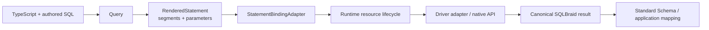
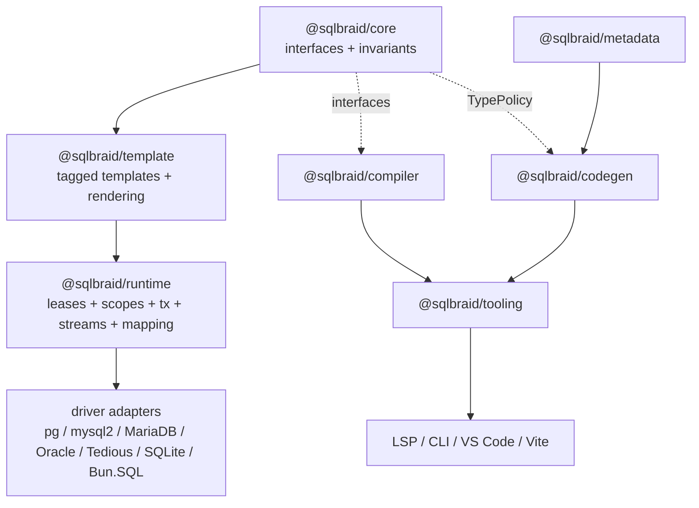
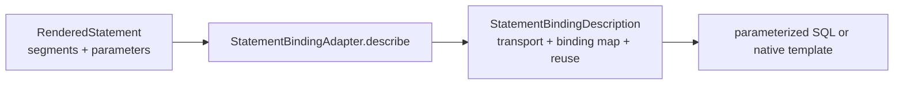
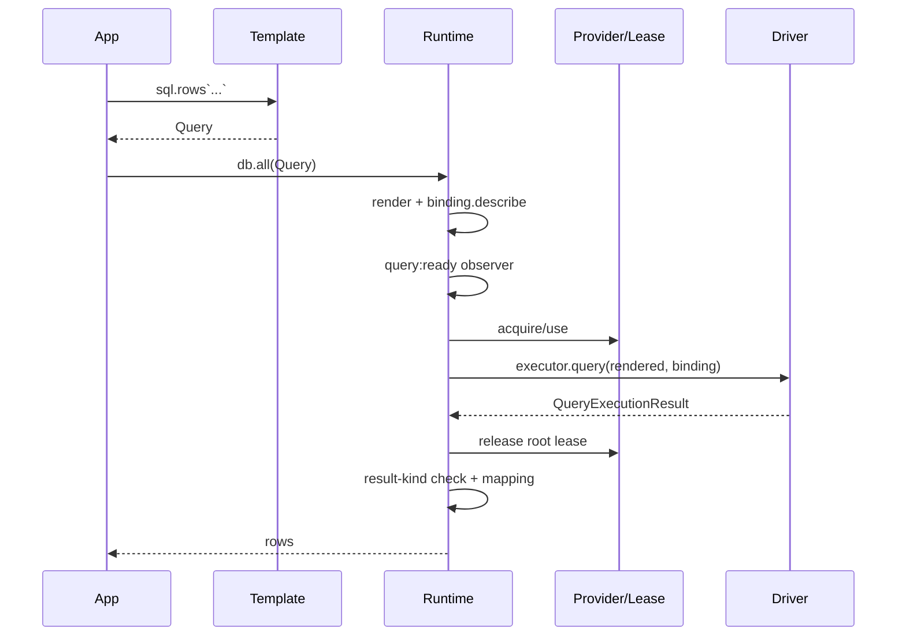
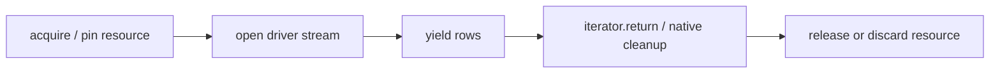

# SQLBraid contributor mental model

[한국어](./mental-model.ko.md)

This guide gives contributors a short overview of the internal architecture of SQLBraid. It is a reading map and a design model. It does not replace the public API audit, the driver-author guide, the support records or the tests.

## 1. The architecture at a glance

SQLBraid keeps the SQL that the user writes visible. It also separates concerns that database libraries often mix.


```mermaid
flowchart LR
  A[TypeScript + authored SQL] --> Q[Query]
  Q --> R[RenderedStatement<br/>segments + parameters]
  R --> B[StatementBindingAdapter]
  B --> X[Runtime resource lifecycle]
  X --> D[Driver adapter / native API]
  D --> C[Canonical SQLBraid result]
  C --> M[Standard Schema / application mapping]
```

The execution core has four layers:


```mermaid
flowchart TB
  CORE["@sqlbraid/core<br/>interfaces + invariants"]
  TEMPLATE["@sqlbraid/template<br/>tagged templates + rendering"]
  RUNTIME["@sqlbraid/runtime<br/>leases + scopes + tx + streams + mapping"]
  ADAPTERS["driver adapters<br/>pg / mysql2 / MariaDB / Oracle / Tedious / SQLite / Bun.SQL"]
  CORE --> TEMPLATE --> RUNTIME --> ADAPTERS

  COMPILER["@sqlbraid/compiler"]
  METADATA["@sqlbraid/metadata"]
  CODEGEN["@sqlbraid/codegen"]
  TOOLING["@sqlbraid/tooling"]
  LSP["LSP / CLI / VS Code / Vite"]
  COMPILER --> TOOLING --> LSP
  METADATA --> CODEGEN --> TOOLING
  CORE -. interfaces .-> COMPILER
  CORE -. TypePolicy .-> CODEGEN
```

The `sqlbraid` package is mainly the canonical facade. It re-exports the other packages. When you read the implementation code, start with the four execution layers above.

## 2. The central invariant: SQL structure and values stay separate

Ordinary interpolation is always a value bind:

```ts
const query = sql.rows<User>`
  SELECT id, name
  FROM users
  WHERE id = ${userId}
`;
```

At this point, the logical statement is not `WHERE id = $1`, `WHERE id = ?` or `WHERE id = :1`. It is a list of SQL segments and a list of parameters.

`RenderedStatement` keeps this invariant:

```text
segments.length === parameters.length + 1
```

A rendered parameter is a value. It is not an identifier, a nested query, a raw driver fragment or a placeholder string.

SQL structure must be explicit. Use helpers such as `sql.ident`, `sql.fragment`, `sql.list`, `sql.join` and `sql.empty`. `sql.raw` is the deliberate escape hatch.

Because of this boundary, the adapter can own the placeholder syntax. The same SQL model can then target different drivers.

## 3. `@sqlbraid/core`: the interface layer

The most important source file is [`packages/core/src/index.ts`](../packages/core/src/index.ts). Treat it as the protocol that authoring, runtime and adapters share. It is not a normal implementation module.

The main groups are:

- query and result types: `Query`, `RowQuery`, `CommandQuery`, `CallQuery`, `QueryExecutionResult`;
- logical statement types: `RenderedStatement`, `RenderedParameter`, `RenderedBulk`;
- the binding SPI: `StatementBindingAdapter`, `StatementBindingDescription`, reuse and transport types;
- the physical execution SPI: `QueryExecutor`, `ConnectionLease`, `ConnectionProvider`;
- the application runtime surface: `Database`, prepared-query types, execution and transaction options;
- representation types: `TypePolicy`, `TypeMapping`;
- observer, capability, routine and public error types.

The smaller file [`packages/core/src/driver.ts`](../packages/core/src/driver.ts) contains helpers for driver authors. They help with resource cleanup, safe result properties and generated savepoint names.

### A Query is not physical SQL

A `Query` keeps the template IR, the captured values, the declared result kind and optional metadata for application mapping. `query.render()` produces a `RenderedStatement`. It does not execute a driver. It does not select the native placeholder syntax.

## 4. `@sqlbraid/template`: authoring and rendering

After core, read [`packages/template/src/index.ts`](../packages/template/src/index.ts).

`createSqlTag()` builds a dialect-bound `sql` tag. The tag creates frozen `Query` objects. If the statement does not need structural processing, the tag delays the template parse.

The authoring surface keeps value data separate from SQL structure:

- `${value}` → a value bind;
- `sql.ident(name)` → a quoted identifier;
- `sql.fragment` → explicit SQL structure that you can compose;
- `sql.list(values)` → a structural list that contains value binds;
- `sql.join(fragments)` → structural composition;
- `sql.raw(text)` → SQL structure without change; do not give it untrusted input;
- `sql.bind(value, hint)` → a value with explicit database parameter metadata.

Fragments are dialect-bound. SQLBraid rejects a fragment from a different dialect. It does not silently quote it again or read its structure in a different way.

### Guarded `@braid` directives

`@braid` directives give local dynamic SQL: `if`, `choose`, `when`, `otherwise`, `where`, `set` and `trim`. The runtime renderer understands the IR. But JavaScript evaluates ordinary template expressions immediately.

Thus, the compiler lowers guarded captures. Then JavaScript does not evaluate expressions in inactive branches. Runtime helpers such as `guarded()` and `capture()` are targets for the compiler. They are not a second query language for applications.

## 5. Binding: where `$1`, `?`, `:1` and `@p1` appear

`StatementBindingAdapter` is the boundary between a logical statement and a driver transport.


```mermaid
flowchart LR
  R[RenderedStatement<br/>segments + parameters] --> S[StatementBindingAdapter.describe]
  S --> B[StatementBindingDescription<br/>transport + binding map + reuse]
  B --> P[parameterized SQL or native template]
```

The binding description is pure. It occurs before connection acquisition. Thus, an invalid hint, transport rule or binding identity fails before it uses a pool lease.

Because of this separation, PostgreSQL, MySQL, Oracle, SQL Server and native-template transports can materialize the same logical shape in different ways. The query identity does not change.

## 6. `@sqlbraid/runtime`: the lifecycle is the difficult part

The main runtime file is [`packages/runtime/src/index.ts`](../packages/runtime/src/index.ts). Most of its size comes from the ownership of physical resources, not from SQL parsing.

The central constructor is `createScopedDatabase()`. `createDatabase()` and `createPooledDatabase()` both use it.

For a normal materialized query, read these functions in this sequence:

```text
prepareObserved()
    ↓
prepare()
    ↓
runPrepared()
    ↓
physical()
    ↓
finalizePhysical()
    ↓
processRows()
```

A typical `db.all(query)` goes through this lifecycle:


```mermaid
sequenceDiagram
  participant App
  participant Template
  participant Runtime
  participant Pool as Provider/Lease
  participant Driver
  App->>Template: sql.rows`...`
  Template-->>App: Query
  App->>Runtime: db.all(Query)
  Runtime->>Runtime: render + binding.describe
  Runtime->>Runtime: query:ready observer
  Runtime->>Pool: acquire/use
  Runtime->>Driver: executor.query(rendered, binding)
  Driver-->>Runtime: QueryExecutionResult
  Runtime->>Pool: release root lease
  Runtime->>Runtime: result-kind check + mapping
  Runtime-->>App: rows
```

### Release before application mapping

For materialized pooled operations, SQLBraid releases the lease after the driver I/O and the result materialization. It releases the lease before the asynchronous Standard Schema mapping. Application validation or transformation must not hold a pool connection, because pool connections are limited.

Streaming is different on purpose. The native cursor or result set still needs its physical resource.

## 7. Direct executors, providers and leases

`createDatabase(executor)` wraps one physical execution resource that already exists. SQLBraid serializes access to it. SQLBraid does not own the shutdown of the client or database.

`createPooledDatabase(provider)` wraps a `ConnectionProvider`. A provider is a source of physical leases. It is not a fake connection.

For a pooled root materialized operation:

```text
provider.acquire()
    ↓
ConnectionLease
    ↓
physical I/O
    ↓
lease.release()
```

`ConnectionLease` extends `QueryExecutor`. It adds the ownership of release and discard. The provider and its leases must expose the same statement-binding policy.

## 8. Scope state and physical ownership

`ScopeState` is the runtime state machine that keeps resources safe.

The important fields are:

- `tail`: serializes ordinary direct or root physical work;
- `transactionTail`: orders pinned physical work and the transitions of transaction control;
- `streamUsers` / `pendingStreams`: track a stream that is live or that the runtime is admitting;
- `activeScope`: identifies the transaction or savepoint handle that is currently valid;
- `activeSession`: identifies the session handle that is currently valid;
- `poisoned`: keeps the failure that made the physical resource unsafe to reuse.

The async context and these markers prevent an operation from silently escaping to a different connection.

## 9. `session()`: pin without a transaction

`db.session(callback)` pins one physical resource for the callback. It does not begin a transaction.

For a pool:

```text
acquire one lease
    ↓
all nested session operations reuse it
    ↓
release after callback/scoped streams finish
```

Nested sessions use the current pinned resource again. `session.tx()` begins a transaction on that same resource. It does not acquire a second lease.

The scoped `Database` must not escape the callback. If a use of the root handle would break physical affinity, SQLBraid rejects it. SQLBraid does not redirect it to a different connection.

Use a session when correctness depends on state that is local to the connection, but not always on a transaction.

## 10. `tx()`: one physical transaction, nested savepoints

An outer `db.tx(callback)` acquires or reuses one physical resource. It begins a transaction and runs the callback. Then it commits or rolls back on the same resource.

A nested `tx.tx(callback)` is not an independent transaction. It is a savepoint on the same physical resource:

```text
SAVEPOINT
callback
RELEASE SAVEPOINT
```

If the callback fails, SQLBraid rolls back to the savepoint. If the resource stays healthy, SQLBraid then releases the savepoint.

SQLBraid rejects a nested `tx(options, callback)`. Isolation and access options belong to the outer physical transaction. SQLBraid does not invent semantics to change them inside an active transaction.

While a nested savepoint is active, use the innermost callback handle. SQLBraid rejects use of a parent or root handle. This prevents scope escape.

## 11. A stream owns the lease until iteration closes

`db.stream()` is not a buffered `all()` facade. A live native cursor, portal, result set, request or statement keeps the physical resource.


```mermaid
flowchart LR
  A[acquire / pin resource] --> B[open driver stream]
  B --> C[yield rows]
  C --> D[iterator.return / native cleanup]
  D --> E[release or discard resource]
```

An early `break`, an exception, a cancellation and a mapping failure all start cleanup. The driver iterator cleanup occurs before the lease release.

A live pinned stream prevents conflicting re-entry. It also prevents transaction and savepoint transitions on the same resource. SQLBraid rejects the operation. It does not depend on behavior that the driver leaves undefined.

## 12. Prepared queries, batch and bulk

### Prepared queries

`db.prepare()` means a stable SQLBraid logical shape. It does not promise that the database server has an entry in a prepared statement cache.

The first execution sets the shape: result kind, canonical segments, ordered parameter metadata and dialect. Values can change. A structural change fails with `BRAID_PREPARED_SHAPE` before driver I/O.

The adapter decides the effective native or server reuse separately.

### Batch

`db.batch()` does these steps:

1. It prepares several executable queries. The queries can be different.
2. It gets one physical use or lease.
3. It executes the queries in sequence.
4. It releases the use or lease.
5. It processes the results.

A batch is not a transaction. When you need atomicity, use `db.tx(tx => tx.batch(...))`.

### Bulk

`db.bulk()` is one homogeneous command shape with many input rows. The adapter selects the physical strategy: `native-bulk`, `pipeline`, `prepared-loop` or `remote-batch`. The strategy label does not mean transaction atomicity.

## 13. TypePolicy and Standard Schema solve different problems

`TypePolicy` belongs at the driver boundary:

```text
database/native driver value
    ↓
canonical SQLBraid JavaScript representation
```

Examples are exact integers and decimals as strings, binary values, temporal profiles and the JSON representation policy.

Standard Schema belongs at the application mapping boundary:

```text
canonical JavaScript representation
    ↓
application/domain value
```

For example, a conversion of an exact decimal string into an application Decimal or Money type is application mapping. It is not driver transport policy.

These layers stay separate. Thus, the runtime does not need a universal input/output codec framework.

## 14. Driver adapters: thin physical bridges

Use [`packages/postgres/src/pg.ts`](../packages/postgres/src/pg.ts) as the first reference adapter. Then read the Oracle adapter as an example with many resources.

A driver adapter does four main things:

1. It implements `StatementBindingAdapter`.
2. It implements `QueryExecutor`, and optionally pool or provider leases.
3. It normalizes native results into the SQLBraid row, command and routine types.
4. It reports honest evidence about the environment, capabilities and representation.

`*Like` interfaces such as `PgClientLike` are small structural subsets of native driver APIs. They describe what SQLBraid needs. They are not a competing driver abstraction.

### Dialect, driver and runtime are different

```text
dialect  = SQL quoting and lexical/structural behavior
driver   = protocol/API bridge and result normalization
runtime  = Node, Bun, Deno, browser, Worker
```

Thus, each PostgreSQL-capable driver does not need its own copy of the PostgreSQL dialect logic. For the same reason, SQLite has one dialect and several execution adapters.

## 15. Errors, cleanup and poisoned resources

SQLBraid keeps the primary failure. It still tries to clean up the resources that it owns. Where it is correct, driver resource cleanup uses LIFO scopes. SQLBraid aggregates cleanup failures. It does not hide the original error.

If transaction control, stream cleanup, cancellation or lease cleanup leaves a physical resource in an uncertain state, the resource becomes poisoned:

- SQLBraid discards a pooled lease. It does not return the lease for reuse.
- A direct poisoned resource rejects all subsequent SQLBraid work.

Correctness is more important than optimistic connection reuse.

## 16. Observers and capabilities

`ExecutionObserver` can only observe or fail. It can inspect lifecycle events and it can throw. It cannot rewrite SQL, binds, results, routing, retries or transaction targets.

Capabilities describe what an adapter or resource can actually support. SQLBraid does not silently emulate missing physical semantics. For example, an adapter without a real streaming protocol rejects `db.stream()`. It does not buffer a complete result and then act as if it streamed.

The optional OpenTelemetry package connects through this observer surface. It does not patch runtime execution.

## 17. The static tooling subsystem is separate

The runtime core does not depend on metadata, compiler, codegen, CLI, editor or Vite packages. This is intentional.

- `@sqlbraid/metadata` records database evidence.
- `@sqlbraid/codegen` is a pure offline transform: metadata + TypePolicy → TypeScript models.
- `@sqlbraid/compiler` owns source discovery and lowering.
- `@sqlbraid/tooling` combines positive evidence from the compiler, metadata and codegen for CLI, LSP and editor use.

Missing metadata stays unresolved evidence. It does not prove that user SQL is invalid.

## 18. Recommended source reading order

Do not read the repository in alphabetical order. Use this sequence:

1. the README sections about the core boundary, sessions and prepared queries;
2. `packages/core/src/index.ts`: `RenderedStatement`, `Query`, `StatementBindingAdapter`, `QueryExecutor`, `ConnectionProvider`, `Database`, `SqlTag`;
3. `packages/template/src/index.ts`: `createSqlTag()` → `renderTemplateIr()` / `renderNodes()`;
4. `packages/runtime/src/index.ts`: `createDatabase` / `createPooledDatabase` → `createScopedDatabase` → `prepare` → `leaseForUse` → `physical` → `runPrepared` → `finalizePhysical` → `processRows`;
5. the runtime `stream()`, separately;
6. the runtime `session()` and `tx()`;
7. PostgreSQL `pgStatementBinding` and `createPgExecutor()` as the first adapter;
8. Oracle or a different adapter with many resources;
9. compiler → metadata → codegen → tooling, only when you work on static tooling.

## 19. Invariants that contributors must protect

Before you change the architecture, make sure that the change keeps these rules:

- Ordinary interpolation stays a value bind.
- SQL structure is explicit.
- The logical statement shape does not depend on the transport.
- The binding description stays pure and occurs before acquisition.
- The binding identity of the provider and the lease stays the same.
- Materialized pooled results release the lease before application mapping.
- Streams keep their resources until the native iterator cleanup.
- Sessions pin without silently starting a transaction.
- Nested transactions stay savepoints on the same physical resource.
- SQLBraid rejects scope escape to a root or parent. It does not route the work again.
- Cleanup tries all owned resources and keeps the primary failure.
- SQLBraid poisons or discards uncertain physical resources.
- Unsupported capabilities fail explicitly. SQLBraid does not simulate them.
- TypePolicy owns the transport representation. Standard Schema owns application mapping.
- Observers observe or fail. They do not rewrite execution.
- The runtime stays independent of the compiler, metadata, codegen and tooling.

## 20. Where to put a change

- public interfaces / SPI → `@sqlbraid/core`
- tagged-template structure/rendering → `@sqlbraid/template`
- leases/scopes/transactions/streams/mapping → `@sqlbraid/runtime`
- placeholder/native protocol/result normalization → driver adapter
- database primitive representation → dialect/driver TypePolicy
- schema facts → `@sqlbraid/metadata` + inspector
- generated TS models → `@sqlbraid/codegen`
- source lowering/type overlay → `@sqlbraid/compiler`
- hover/completion/workspace/LSP evidence → tooling/language-server
- tracing/metrics → observer extension such as `@sqlbraid/opentelemetry`

If a change seems to cross several of these boundaries, first find out if a smaller explicit rule can express the requirement. SQLBraid prefers explicit boundaries to hidden semantic machinery. This is a deliberate choice.

## Related architecture references

- [Public API audit](./public-api-audit.md)
- [Driver-author guide](./driver-author-guide.md)
- [Release readiness](./SQLBraid_release_readiness.md)
- [Writing style](./writing-style.md)
- [Repository rules](../AGENTS.md)
